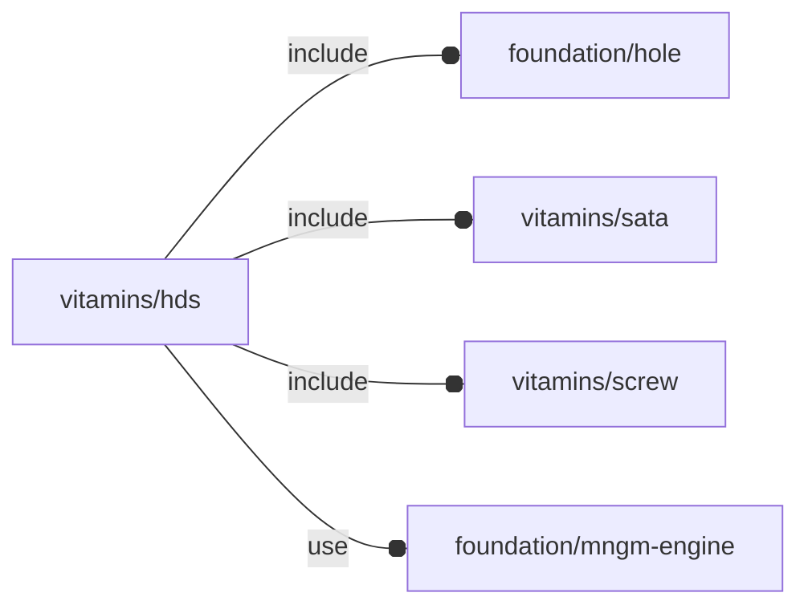

# package vitamins/hds

## Dependencies

Hard disk definition file. Specs taken from [2.5 inch Hard Drive - Geekworm
Wiki](https://wiki.geekworm.com/2.5_inch_Hard_Drive)

This file is part of the 'OpenSCAD Foundation Library' (OFL) project.

Copyright © 2021, Giampiero Gabbiani <giampiero@gabbiani.org>

SPDX-License-Identifier: [GPL-3.0-or-later](https://spdx.org/licenses/GPL-3.0-or-later.html)

## Variables

---

### variable FL_HD_DICT

__Default:__

    [FL_HD_EVO860]

---

### variable FL_HD_EVO860

__Default:__

    let(size=[69.85,100,7],plug=FL_SATA_POWERDATAPLUG,cid=fl_sata_powerDataCID(),screw=M3_cs_cap_screw,screw_r=screw_radius(screw),Mpd=T(-X(4.8)-Z(NIL))*fl_Rx(90)*fl_octant(+Y-Z,type=plug),conns=fl_connectors(plug),pc=fl_conn_clone(conns[0],M=Mpd),dc=fl_conn_clone(conns[1],M=Mpd))[fl_name(value="Samsung V-NAND SSD 860 EVO"),fl_engine(value=FL_HD_NS),fl_bb_corners(value=[[-size.x/2,0,0],[+size.x/2,+size.y,+size.z],]),["offset",[0,-size.y/2,-size.z/2]],["corner radius",3],fl_screw(value=screw),fl_sata_plug(value=plug),fl_connectors(value=[pc,dc]),fl_holes(value=[fl_Hole([size.x/2-3.5,14,0],3,-Z,3+screw_r),fl_Hole([size.x/2-3.5,90.6,0],3,-Z,3+screw_r),fl_Hole([-size.x/2+3.5,14,0],3,-Z,3+screw_r),fl_Hole([-size.x/2+3.5,90.6,0],3,-Z,3+screw_r),fl_Hole([size.x/2,14,3],3,+X,3.5+screw_r),fl_Hole([size.x/2,90.6,3],3,+X,3.5+screw_r),fl_Hole([-size.x/2,14,3],3,-X,3.5+screw_r),fl_Hole([-size.x/2,90.6,3],3,-X,3.5+screw_r),]),["Mpd",Mpd],]

---

### variable FL_HD_NS

__Default:__

    "hd"

## Modules

---

### module fl_hd

__Syntax:__

    fl_hd(verbs,type,thick,lay_direction=[-X,+X,-Z],dri_tolerance=fl_JNgauge,dri_rails=[[0,0],[0,0],[0,0]],add_connectors=false,direction,octant)

Children context during FL_LAYOUT (in addition to holes' context):

 - $hd_thick     : scalar thickness along hole normal
 - $hd_screw_len : screw length along hole normal comprehensive of hole depth and tolerance

__Parameters:__

__thick__  
thickness matrix for FL_DRILL, FL_CUTOUT in fixed form [[-X,+X],[-Y,+Y],[-Z,+Z]].

scalar «t» means `[[t,t],[t,t],[t,t]]`

__lay_direction__  
FL_LAYOUT directions in floating semi-axis list form

__dri_tolerance__  
tolerance for FL_DRILL

__dri_rails__  
rail lengths during FL_DRILL in fixed form [[-X,+X],[-Y,+Y],[-Z,+Z]].

__add_connectors__  
FL_ADD connectors

__direction__  
desired direction [vector,rotation], native direction when undef ([+X+Y+Z])

__octant__  
when undef native positioning is used

