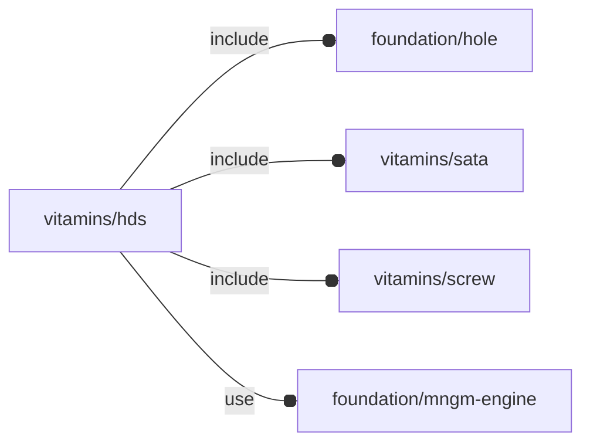

# package vitamins/hds

## Dependencies

Hard disk definition file. Specs taken from [2.5 inch Hard Drive - Geekworm
Wiki](https://wiki.geekworm.com/2.5_inch_Hard_Drive)

This file is part of the 'OpenSCAD Foundation Library' (OFL) project.

Copyright © 2021, Giampiero Gabbiani <giampiero@gabbiani.org>

SPDX-License-Identifier: [GPL-3.0-or-later](https://spdx.org/licenses/GPL-3.0-or-later.html)

## Variables

---

### variable FL_HD_DICT

__Default:__

    [FL_HD_EVO860]

---

### variable FL_HD_EVO860

__Default:__

    let(size=[69.85,100,7],plug=FL_SATA_POWERDATAPLUG,cid=fl_sata_powerDataCID(),screw=M3_cs_cap_screw,screw_r=screw_radius(screw),Mpd=T(-X(4.8)-Z(NIL))*fl_direction([-Y,0])*fl_octant(+Y-Z,type=plug),conns=fl_connectors(plug),pc=fl_conn_clone(conns[0],M=Mpd),dc=fl_conn_clone(conns[1],M=Mpd))fl_Object(name="Samsung V-NAND SSD 860 EVO",engine=FL_HD_NS,bbox=[[-size.x/2,0,0],[+size.x/2,+size.y,+size.z],],others=[["offset",[0,-size.y/2,-size.z/2]],["corner radius",3],fl_screw(value=screw),fl_sata_plug(value=plug),fl_connectors(value=[pc,dc]),fl_holes(value=[fl_Hole([size.x/2-3.5,14,0],3,-Z,3+screw_r),fl_Hole([size.x/2-3.5,90.6,0],3,-Z,3+screw_r),fl_Hole([-size.x/2+3.5,14,0],3,-Z,3+screw_r),fl_Hole([-size.x/2+3.5,90.6,0],3,-Z,3+screw_r),fl_Hole([size.x/2,14,3],3,+X,3.5+screw_r),fl_Hole([size.x/2,90.6,3],3,+X,3.5+screw_r),fl_Hole([-size.x/2,14,3],3,-X,3.5+screw_r),fl_Hole([-size.x/2,90.6,3],3,-X,3.5+screw_r),]),["Mpd",Mpd],fl_cutout(value=[-Y]),])

---

### variable FL_HD_NS

__Default:__

    "hd"

## Modules

---

### module fl_hd

__Syntax:__

    fl_hd(verbs=FL_ADD,type,lay_direction=[-X,+X,-Z],dri_rails=[[0,0],[0,0],[0,0]],drift=0,cut_dirs,octant,direction)

Hard-drive engine.

Context variables:

| Name           | Context   | Description                           |
| ------------   | -------   | ------------------------------------- |
| $hd_thick      | Children  | scalar thickness along hole normal    |
| $hd_screw_len  | Children  | screw length along hole normal comprehensive of hole depth and tolerance |
| $hole_*        | Children  | see [fl_hole_Context{}](../foundation/hole.md#module-fl_hole_context)                 |
| $dbg_Symbols   | Execution | When true connector symbols are shown |
| $fl_thickness  | Parameter | thickness in fixed form [[-X,+X],[-Y,+Y],[-Z,+Z]]  |
| $fl_tolerance  | Parameter | Used during FL_CUTOUT and FL_DRILL    |

__Parameters:__

__verbs__  
FL_ASSEMBLY, FL_AXES, FL_MOUNT, FL_LAYOUT, FL_DRILL, FL_BBOX, FL_FOOTPRINT, FL_CUTOUT

__lay_direction__  
FL_LAYOUT directions in floating semi-axis list form

__dri_rails__  
rail lengths during FL_DRILL in fixed form [[-X,+X],[-Y,+Y],[-Z,+Z]].

__drift__  
FL_CUTOUT scalar drift

__cut_dirs__  
Cutout direction list in floating semi-axis list (see also [fl_tt_isAxisList()](../foundation/traits-engine.md#function-fl_tt_isaxislist)).

Example:

    cut_dirs=[+X,+Z]

in this case the ethernet plug will perform a cutout along +X and +Z.

__octant__  
when undef native positioning is used

__direction__  
desired direction [vector,rotation], native direction when undef ([+X+Y+Z])

