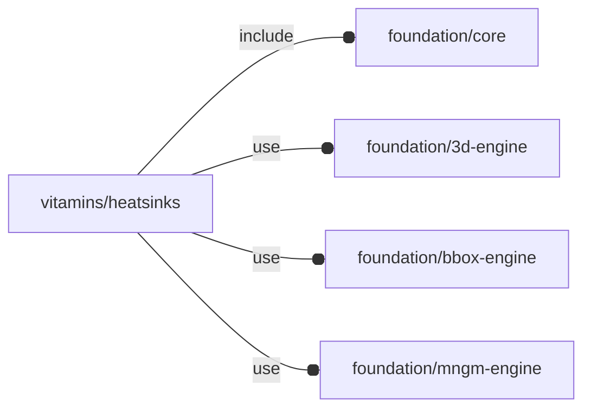

# package vitamins/heatsinks

## Dependencies



Heatsinks definition file.

Copyright © 2021, Giampiero Gabbiani (giampiero@gabbiani.org)

SPDX-License-Identifier: [GPL-3.0-or-later](https://spdx.org/licenses/GPL-3.0-or-later.html)


## Variables

---

### variable FL_HS_DICT

__Default:__

    [FL_HS_PIMORONI_TOP,FL_HS_PIMORONI_BOTTOM,FL_HS_KHADAS]

---

### variable FL_HS_KHADAS

__Default:__

    let(Zs=2,Zh=1,Zf=5.45,Zt=2.2)[fl_name(value="KHADAS VIM SBC Heatsink"),fl_bb_corners(value=[[0.5,-49.57,0],[81.49,-0.49,Zs+Zh+Zf],]),fl_screw(value=M2_cap_screw),fl_dxf(value="vitamins/hs-khadas.dxf"),fl_engine(value="Khadas"),fl_cutout(value=[+FL_X,-FL_X,+FL_Y,-FL_Y,+FL_Z,-FL_Z]),fl_property(key="separator height",value=Zs),fl_property(key="heatsink height",value=Zh),fl_property(key="fin height",value=Zf),fl_property(key="tooth height",value=Zt),]

---

### variable FL_HS_NS

__Default:__

    "hs"

namespace

---

### variable FL_HS_PIMORONI_BOTTOM

__Default:__

    let(Tbase=2,Tfluting=2.3,Tholders=3,Tchamfer=2.3,size=[56,87,Tbase+Tfluting+Tholders])[fl_name(value="PIMORONI Raspberry Pi 4 Heatsink Case - bottom"),fl_bb_corners(value=[[-size.x/2,0,-size.z],[+size.x/2,size.y,0],]),fl_screw(value=M2p5_cap_screw),fl_dxf(value="vitamins/pimoroni.dxf"),fl_vendor(value=[["Amazon","https://www.amazon.it/gp/product/B082Y21GX5/"],]),fl_engine(value="Pimoroni"),fl_cutout(value=[+FL_X,-FL_X,+FL_Y,-FL_Y,+FL_Z,-FL_Z]),["corner radius",3],["chamfer thickness",Tchamfer],["base thickness",Tbase],["fluting thickness",Tfluting],["holders thickness",Tholders],["part","bottom"],]

---

### variable FL_HS_PIMORONI_TOP

__Default:__

    let(Tbase=1.5,Tfluting=8.6,Tholders=5.5,Tchamfer=2.3,size=[56,70,Tbase+Tfluting+Tholders])[fl_name(value="PIMORONI Raspberry Pi 4 Heatsink Case - top"),fl_bb_corners(value=[[-size.x/2,0,0],[+size.x/2,size.y,size.z],]),fl_screw(value=M2p5_cap_screw),fl_dxf(value="vitamins/pimoroni.dxf"),fl_vendor(value=[["Amazon","https://www.amazon.it/gp/product/B082Y21GX5/"],]),fl_engine(value="Pimoroni"),fl_cutout(value=[+FL_X,-FL_X,+FL_Y,-FL_Y,+FL_Z,-FL_Z]),["corner radius",3],["chamfer thickness",Tchamfer],["base thickness",Tbase],["fluting thickness",Tfluting],["holders thickness",Tholders],["part","top"],]

## Functions

---

### function fl_pimoroni

__Syntax:__

```text
fl_pimoroni(verb=FL_ADD,type,thick=0,lay_what="mount",top=true,bottom=true,direction,octant)
```

TODO: TO BE REMOVED


__Parameters:__

__verb__  
supported verbs: FL_ADD, FL_ASSEMBLY, FL_BBOX, FL_DRILL, FL_FOOTPRINT, FL_LAYOUT

__thick__  
FL_DRILL thickness in scalar form for -Z normal

__lay_what__  
either "mount" or "assembly"

__top__  
top part

__bottom__  
bottom part

__direction__  
desired direction [director,rotation], native direction when undef ([+X+Y+Z])

__octant__  
when undef native positioning is used


## Modules

---

### module fl_heatsink

__Syntax:__

    fl_heatsink(verbs=FL_ADD,type,cut_thick,cut_tolerance=0,cut_drift=0,cut_direction,direction,octant)

common wrapper for different heat sink model engines.


__Parameters:__

__verbs__  
supported verbs: FL_ADD, FL_AXES, FL_BBOX, FL_CUTOUT, FL_FOOTPRINT

__cut_thick__  
thickness for FL_CUTOUT

__cut_tolerance__  
tolerance used during FL_CUTOUT

__cut_drift__  
translation applied to cutout (default 0)

__cut_direction__  
Cutout direction list in floating semi-axis list (see also [fl_tt_isAxisList()](../foundation/type_trait.md#function-fl_tt_isaxislist)).

Example:

    cut_direction=[+X,+Z]

in this case the heatsink will perform a cutout along +X and +Z.

:memo: **Note:** axes specified must be present in the supported cutout direction
list (retrievable through [fl_cutout()](../foundation/core.md#function-fl_cutout) getter)


__direction__  
desired direction [director,rotation], native direction when undef ([+X+Y+Z])

__octant__  
when undef native positioning is used


