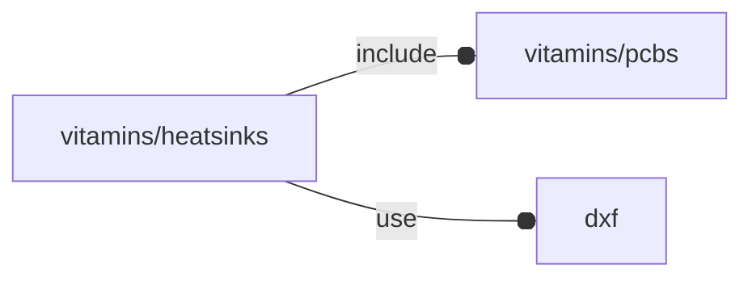

# package vitamins/heatsinks

## Dependencies



## Variables

---

### variable FL_HS_DICT

__Default:__

    [FL_HS_PIMORONI]

---

### variable FL_HS_NS

__Default:__

    "hs"

---

### variable FL_HS_PIMORONI

__Default:__

    let(size=[56,87,25.5])[fl_name(value="PIMORONI Heatsink Case"),fl_description(value="PIMORONI Aluminium Heatsink Case for Raspberry Pi 4"),fl_bb_corners(value=[[-size.x/2,0,0],[+size.x/2,size.y,size.z],]),fl_screw(value=M2p5_cap_screw),fl_director(value=+FL_Z),fl_rotor(value=+FL_X),fl_dxf(value="vitamins/pimoroni.dxf"),["corner radius",3],["bottom part",[["layer 0 base thickness",2],["layer 0 fluting thickness",2.3],["layer 0 holders thickness",3],]],["top part",[["layer 1 base thickness",1.5],["layer 1 fluting thickness",8.6],["layer 1 holders thickness",5.5],]],fl_vendor(value=[["Amazon","https://www.amazon.it/gp/product/B082Y21GX5/"],]),]

## Functions

---

### function bottom_sz

__Syntax:__

```text
bottom_sz()
```

---

### function fl_bb_pimoroni

__Syntax:__

```text
fl_bb_pimoroni(type,top=true,bottom=true)
```

---

### function fl_pimoroni

__Syntax:__

```text
fl_pimoroni(verb=FL_ADD,type,thick=0,lay_what="mount",top=true,bottom=true,direction,octant)
```

## Modules


---

### module fl_pimoroni

__Syntax:__

    fl_pimoroni(verbs=FL_ADD,type,thick=0,lay_what="mount",top=true,bottom=true,direction,octant)

