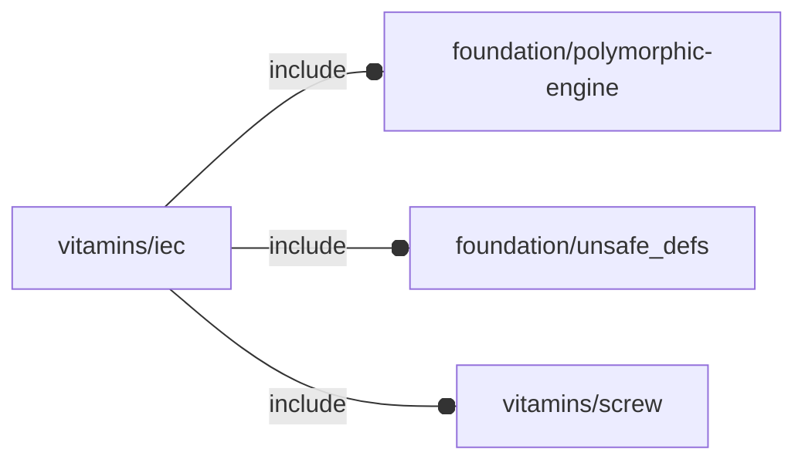

# package vitamins/iec

## Dependencies



## Variables

---

### variable FL_IEC_320_C14_SWITCHED_FUSED_INLET

__Default:__

    fl_IEC(IEC_320_C14_switched_fused_inlet)

IEC320 C14 switched fused inlet module.


---

### variable FL_IEC_DICT

__Default:__

    [FL_IEC_FUSED_INLET,FL_IEC_FUSED_INLET2,FL_IEC_320_C14_SWITCHED_FUSED_INLET,FL_IEC_INLET,FL_IEC_INLET_ATX,FL_IEC_INLET_ATX2,FL_IEC_YUNPEN,FL_IEC_OUTLET,]

---

### variable FL_IEC_FUSED_INLET

__Default:__

    fl_IEC(IEC_fused_inlet)

IEC fused inlet JR-101-1F.


---

### variable FL_IEC_FUSED_INLET2

__Default:__

    fl_IEC(IEC_fused_inlet2)

IEC fused inlet old.


---

### variable FL_IEC_INLET

__Default:__

    fl_IEC(IEC_inlet)

IEC inlet.


---

### variable FL_IEC_INLET_ATX

__Default:__

    fl_IEC(IEC_inlet_atx)

IEC inlet for ATX.


---

### variable FL_IEC_INLET_ATX2

__Default:__

    fl_IEC(IEC_inlet_atx2)

IEC die cast inlet for ATX.


---

### variable FL_IEC_NS

__Default:__

    "iec"

---

### variable FL_IEC_OUTLET

__Default:__

    fl_IEC(IEC_outlet)

IEC outlet RS 811-7193.


---

### variable FL_IEC_YUNPEN

__Default:__

    fl_IEC(IEC_yunpen)

IEC inlet filtered.


## Functions

---

### function fl_IEC

__Syntax:__

```text
fl_IEC(nop,name,description)
```

IEC mains inlets and outlet constructor. It wraps the corresponding
NopSCADlib object.


## Modules

---

### module fl_iec

__Syntax:__

    fl_iec(verbs=FL_ADD,this,thick,direction,octant)

__Parameters:__

__thick__  
thickness for FL_DRILL and FL_CUTOUT


