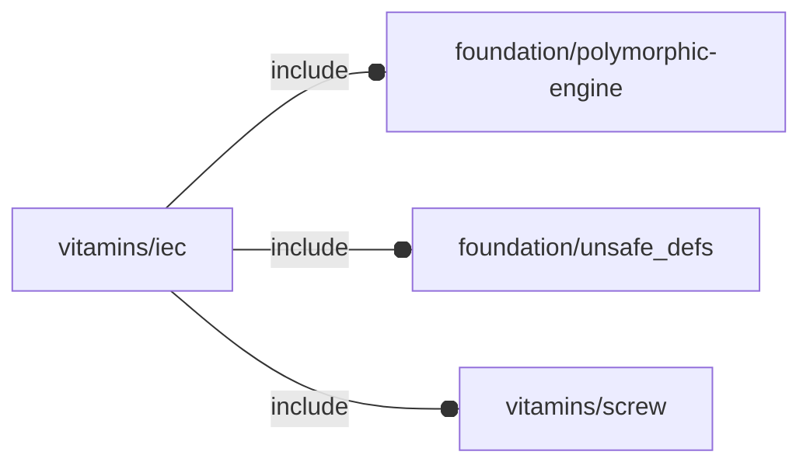
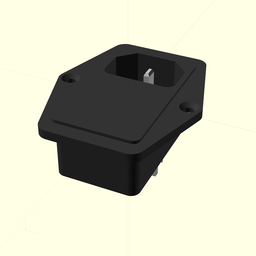
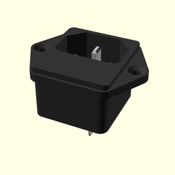
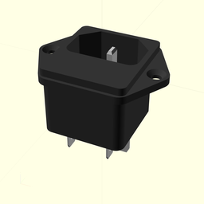
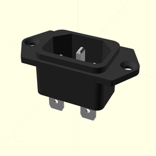
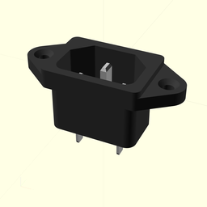
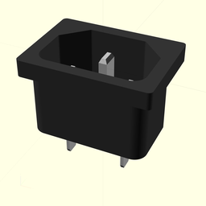
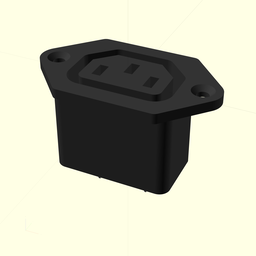
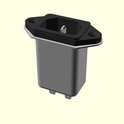

# package vitamins/iec

## Dependencies



NopSCADlib IEC wrapper library. This library wraps NopSCADlib IEC instances
into the OFL APIs.

This file is part of the 'OpenSCAD Foundation Library' (OFL) project.

Copyright © 2021, Giampiero Gabbiani <giampiero@gabbiani.org>

SPDX-License-Identifier: [GPL-3.0-or-later](https://spdx.org/licenses/GPL-3.0-or-later.html)


## Variables

---

### variable FL_IEC_320_C14_SWITCHED_FUSED_INLET

__Default:__

    fl_IEC(IEC_320_C14_switched_fused_inlet)

IEC320 C14 switched fused inlet module.




---

### variable FL_IEC_FUSED_INLET

__Default:__

    fl_IEC(IEC_fused_inlet)

IEC fused inlet JR-101-1F.




---

### variable FL_IEC_FUSED_INLET2

__Default:__

    fl_IEC(IEC_fused_inlet2)

IEC fused inlet old.




---

### variable FL_IEC_INLET

__Default:__

    fl_IEC(IEC_inlet)

IEC inlet.




---

### variable FL_IEC_INLET_ATX

__Default:__

    fl_IEC(IEC_inlet_atx)

IEC inlet for ATX.




---

### variable FL_IEC_INLET_ATX2

__Default:__

    fl_IEC(IEC_inlet_atx2)

IEC die cast inlet for ATX.




---

### variable FL_IEC_INVENTORY

__Default:__

    [FL_IEC_FUSED_INLET,FL_IEC_FUSED_INLET2,FL_IEC_320_C14_SWITCHED_FUSED_INLET,FL_IEC_INLET,FL_IEC_INLET_ATX,FL_IEC_INLET_ATX2,FL_IEC_YUNPEN,FL_IEC_OUTLET,]

---

### variable FL_IEC_NS

__Default:__

    "iec"

---

### variable FL_IEC_OUTLET

__Default:__

    fl_IEC(IEC_outlet)

IEC outlet RS 811-7193.




---

### variable FL_IEC_YUNPEN

__Default:__

    fl_IEC(IEC_yunpen)

IEC inlet filtered.




## Functions

---

### function fl_IEC

__Syntax:__

```text
fl_IEC(nop,name,description)
```

IEC mains inlets and outlet constructor. It wraps the corresponding
NopSCADlib object.


## Modules

---

### module fl_iec

__Syntax:__

    fl_iec(verbs=FL_ADD,this,direction,octant)

Runtime environment:

| variable       | description                               |
| ---            | ---                                       |
| $fl_thickness  | used in FL_CUTOUT, FL_DRILL and FL_MOUNT  |
| $fl_tolerance  | used in FL_CUTOUT                         |


__Parameters:__

__verbs__  
supported verbs: FL_ADD, FL_AXES, FL_BBOX, FL_CUTOUT, FL_DRILL, FL_LAYOUT, FL_MOUNT

__direction__  
desired direction [director,rotation], native direction when undef ([+X+Y+Z])

__octant__  
when undef native positioning is used


