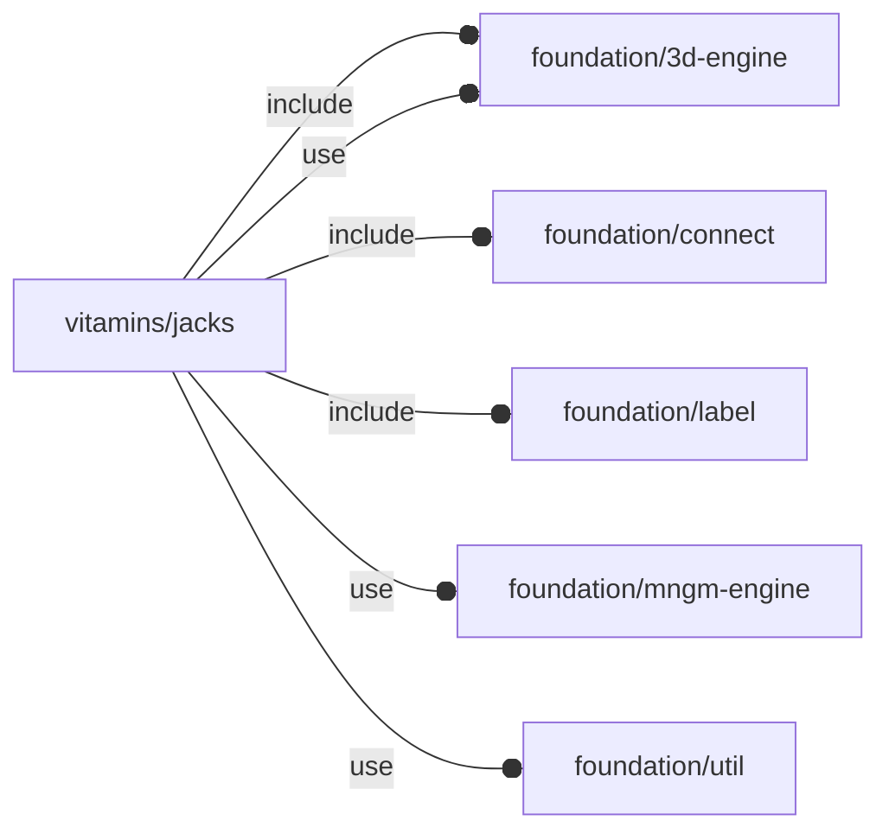
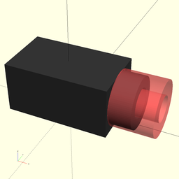
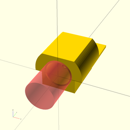

# package vitamins/jacks

## Dependencies

NopSCADlib Jack definitions wrapper.

Copyright © 2021, Giampiero Gabbiani (giampiero@gabbiani.org)

SPDX-License-Identifier: [GPL-3.0-or-later](https://spdx.org/licenses/GPL-3.0-or-later.html)

## Variables

---

### variable FL_JACK_BARREL

__Default:__

    let(l=12,w=7,h=6,ch=2.5,bbox=[[-l/2,-w/2,0],[+l/2+ch,+w/2,h]])fl_Object(bbox,engine=str(FL_JACK_NS,"/barrel"),others=[fl_cutout(value=[+X])])

'Barrel' jack plug.

The supported cutout direction on +X is circular allowing the carving for
jack plug insertion:

---

### variable FL_JACK_DICT

__Default:__

    [FL_JACK_BARREL,FL_JACK_MCXJPHSTEM1,]

---

### variable FL_JACK_MCXJPHSTEM1

__Default:__

    let(name="50Ω MCX EDGE MOUNT JACK PCB CONNECTOR",w=6.7,l=9.3,h=5,sz=[w,l,h],axis=[0,0,0.4],bbox=[[-w/2,0,-h/2+axis.z],[+w/2,l,+h/2+axis.z]],d_ext=6.7,head=6.25,tail=sz.y-head,jack=sz.y-2)fl_Object(bbox,name=name,engine=str(FL_JACK_NS,"/mcx edge mount"),others=[fl_cutout(value=[-Y]),fl_connectors(value=[conn_Socket("antenna",+FL_X,-FL_Z,[0,0,axis.z],size=3.45,octant=-FL_X-FL_Y,direction=[-FL_Z,180])]),["axis of symmetry",axis],["external diameter",d_ext],["head",head],["tail",tail],["jack length",jack]])

Edge mount jack PCB connector.

The supported cutout direction on -Y is circular allowing the carving for
jack plug insertion:

---

### variable FL_JACK_NS

__Default:__

    "jack"

## Modules

---

### module fl_jack

__Syntax:__

    fl_jack(verbs=FL_ADD,type,cut_drift=0,cut_dirs,octant,direction)

Common jack engine adapter.

Context variables:

| Name             | Context   | Description                                           |
| ---------------- | --------- | ----------------------------------------------------- |
| $fl_thickness    | Parameter | Used during FL_CUTOUT (see also [fl_parm_thickness()](../foundation/core.md#function-fl_parm_thickness))  |
| $fl_tolerance    | Parameter | Used during FL_CUTOUT (see [fl_parm_tolerance()](../foundation/core.md#function-fl_parm_tolerance))       |

__Parameters:__

__verbs__  
supported verbs: FL_ADD,FL_AXES,FL_BBOX,FL_CUTOUT

__cut_drift__  
translation applied to cutout

__cut_dirs__  
FL_CUTOUT direction list. Defaults to 'supported' cutout direction

__octant__  
when undef native positioning is used

__direction__  
desired direction [director,rotation], native direction when undef ([+X+Y+Z])

---

### module fl_jack_barrelEngine

__Syntax:__

    fl_jack_barrelEngine(verbs=FL_ADD,type,cut_drift=0,co_dirs,octant,direction)

Barrel jack engine.

Context variables:

| Name             | Context   | Description                                           |
| ---------------- | --------- | ----------------------------------------------------- |
| $fl_thickness    | Parameter | Used during FL_CUTOUT (see also [fl_parm_thickness()](../foundation/core.md#function-fl_parm_thickness))  |
| $fl_tolerance    | Parameter | Used during FL_CUTOUT (see [fl_parm_tolerance()](../foundation/core.md#function-fl_parm_tolerance))       |

__Parameters:__

__verbs__  
supported verbs: FL_ADD,FL_AXES,FL_BBOX,FL_CUTOUT

__cut_drift__  
translation applied to cutout

__co_dirs__  
See [fl_jack{}](#module-fl_jack).

__octant__  
when undef native positioning is used

__direction__  
desired direction [director,rotation], native direction when undef ([+X+Y+Z])

---

### module fl_jack_mcxjphstem1Engine

__Syntax:__

    fl_jack_mcxjphstem1Engine(verbs=FL_ADD,type,cut_drift=0,co_dirs,octant,direction)

Engine for RF MCX edge mount jack pcb connector
specs taken from https://www.rfconnector.com/mcx/edge-mount-jack-pcb-connector

Context variables:

| Name             | Context   | Description                                           |
| ---------------- | --------- | ----------------------------------------------------- |
| $fl_thickness    | Parameter | Used during FL_CUTOUT (see also [fl_parm_thickness()](../foundation/core.md#function-fl_parm_thickness))  |
| $fl_tolerance    | Parameter | Used during FL_CUTOUT (see [fl_parm_tolerance()](../foundation/core.md#function-fl_parm_tolerance))       |

__Parameters:__

__verbs__  
supported verbs: FL_ADD, FL_ASSEMBLY, FL_BBOX, FL_DRILL, FL_FOOTPRINT, FL_LAYOUT

__cut_drift__  
translation applied to cutout

__co_dirs__  
See [fl_jack{}](#module-fl_jack).

__octant__  
when undef native positioning is used

__direction__  
desired direction [director,rotation], native direction when undef ([+X+Y+Z])

