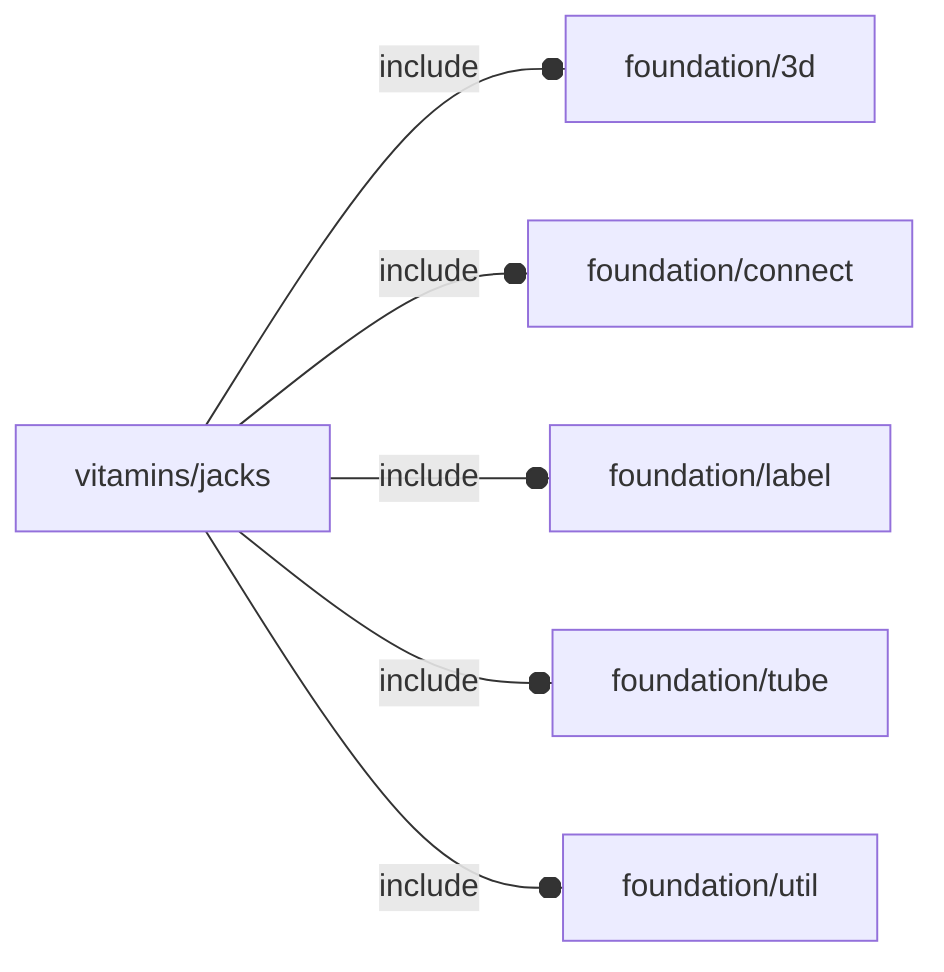

# package vitamins/jacks

## Dependencies

NopACADlib Jack definitions wrapper.

*Published under __GNU General Public License v3__*

## Variables

---

### variable FL_JACK_BARREL

__Default:__

    let(l=12,w=7,h=6,ch=2.5,bbox=[[-l/2,-w/2,0],[+l/2+ch,+w/2,h]])[fl_bb_corners(value=bbox),fl_director(value=+FL_X),fl_rotor(value=+FL_Y),fl_engine(value="fl_jack_barrelEngine"),]

---

### variable FL_JACK_DICT

__Default:__

    [FL_JACK_BARREL,FL_JACK_MCXJPHSTEM1,]

---

### variable FL_JACK_MCXJPHSTEM1

__Default:__

    let(name="50Ω MCX EDGE MOUNT JACK PCB CONNECTOR",w=6.7,l=9.3,h=5,sz=[w,l,h],axis=[0,0,0.4],bbox=[[-w/2,0,-h/2+axis.z],[+w/2,l,+h/2+axis.z]],d_ext=6.7,head=6.25,tail=sz.y-head,jack=sz.y-2)[fl_name(value=name),fl_bb_corners(value=bbox),fl_director(value=-Y),fl_rotor(value=+X),fl_engine(value="fl_jack_mcxjphstem1Engine"),fl_connectors(value=[conn_Socket("antenna",+X,-Z,[0,0,axis.z],size=3.45,octant=-X-Y,direction=[-Z,180])]),["axis of symmetry",axis],["external diameter",d_ext],["head",head],["tail",tail],["jack length",jack]]

---

### variable FL_JACK_NS

__Default:__

    "jack"

## Modules

---

### module fl_jack

__Syntax:__

    fl_jack(verbs=FL_ADD,type,cut_thick,cut_tolerance=0,cut_drift=0,debug,direction,octant)

Jack engine.

__Parameters:__

__verbs__  
supported verbs: FL_ADD,FL_AXES,FL_BBOX,FL_CUTOUT

__cut_thick__  
thickness for FL_CUTOUT

__cut_tolerance__  
tolerance used during FL_CUTOUT

__cut_drift__  
translation applied to cutout

__debug__  
see constructor [fl_parm_Debug()](foundation/base_parameters.md#function-fl_parm_debug)

__direction__  
desired direction [director,rotation], native direction when undef ([+X+Y+Z])

__octant__  
when undef native positioning is used

---

### module fl_jack_barrelEngine

__Syntax:__

    fl_jack_barrelEngine(verbs=FL_ADD,type,cut_thick,cut_tolerance=0,cut_drift=0,debug,direction,octant)

Barrel jack engine.

__Parameters:__

__verbs__  
supported verbs: FL_ADD,FL_AXES,FL_BBOX,FL_CUTOUT

__cut_thick__  
thickness for FL_CUTOUT

__cut_tolerance__  
tolerance used during FL_CUTOUT

__cut_drift__  
translation applied to cutout

__debug__  
see constructor [fl_parm_Debug()](foundation/base_parameters.md#function-fl_parm_debug)

__direction__  
desired direction [director,rotation], native direction when undef ([+X+Y+Z])

__octant__  
when undef native positioning is used

---

### module fl_jack_mcxjphstem1Engine

__Syntax:__

    fl_jack_mcxjphstem1Engine(verbs=FL_ADD,type,cut_thick,cut_tolerance=0,cut_drift=0,debug,direction,octant)

Engine for RF MCX edge mount jack pcb connector
specs taken from https://www.rfconnector.com/mcx/edge-mount-jack-pcb-connector

__Parameters:__

__verbs__  
supported verbs: FL_ADD, FL_ASSEMBLY, FL_BBOX, FL_DRILL, FL_FOOTPRINT, FL_LAYOUT

__cut_thick__  
thickness for FL_CUTOUT

__cut_tolerance__  
tolerance used during FL_CUTOUT

__cut_drift__  
translation applied to cutout

__debug__  
see constructor [fl_parm_Debug()](foundation/base_parameters.md#function-fl_parm_debug)

__direction__  
desired direction [director,rotation], native direction when undef ([+X+Y+Z])

__octant__  
when undef native positioning is used

