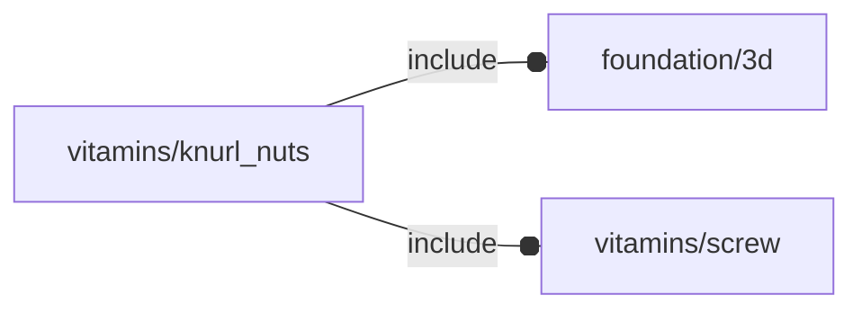

# package vitamins/knurl_nuts

## Dependencies



Knurl nuts (aka 'inserts') definition module.

Copyright © 2021, Giampiero Gabbiani (giampiero@gabbiani.org)

SPDX-License-Identifier: [GPL-3.0-or-later](https://spdx.org/licenses/GPL-3.0-or-later.html)


## Variables

---

### variable FL_KNUT_DICT

__Default:__

    [[FL_KNUT_M2x4x3p5,FL_KNUT_M2x6x3p5,FL_KNUT_M2x8x3p5,FL_KNUT_M2x10x3p5],[FL_KNUT_M3x4x5,FL_KNUT_M3x6x5,FL_KNUT_M3x8x5,FL_KNUT_M3x10x5],[FL_KNUT_M4x4x6,FL_KNUT_M4x6x6,FL_KNUT_M4x8x6,FL_KNUT_M4x10x6],[FL_KNUT_M5x6x7,FL_KNUT_M5x8x7,FL_KNUT_M5x10x7],]

Dictionary organized by internal thread __rows__


---

### variable FL_KNUT_DICT_1

__Default:__

    [FL_KNUT_M2x4x3p5,FL_KNUT_M2x6x3p5,FL_KNUT_M2x8x3p5,FL_KNUT_M2x10x3p5,FL_KNUT_M3x4x5,FL_KNUT_M3x6x5,FL_KNUT_M3x8x5,FL_KNUT_M3x10x5,FL_KNUT_M4x4x6,FL_KNUT_M4x6x6,FL_KNUT_M4x8x6,FL_KNUT_M4x10x6,FL_KNUT_M5x6x7,FL_KNUT_M5x8x7,FL_KNUT_M5x10x7,]

Dictionary sorted by internal thread


---

### variable FL_KNUT_M2x10x3p5

__Default:__

    fl_Knut(M2_cap_screw,10,3.5,0.5,[1.9,2.0,1.9])

- **internal thread**  : M2
- **length**           : 10mm
- **external diameter**: 3.5mm
- **hole diameter**    : ≅ 3.2mm


---

### variable FL_KNUT_M2x4x3p5

__Default:__

    fl_Knut(M2_cap_screw,4,3.5,0.6,[1.15,1.15])

- **internal thread**  : M2
- **length**           : 4mm
- **external diameter**: 3.5mm
- **hole diameter**    : ≅ 3.2mm


---

### variable FL_KNUT_M2x6x3p5

__Default:__

    fl_Knut(M2_cap_screw,6,3.5,0.6,[1.5,1.5])

- **internal thread**  : M2
- **length**           : 6mm
- **external diameter**: 3.5mm
- **hole diameter**    : ≅ 3.2mm


---

### variable FL_KNUT_M2x8x3p5

__Default:__

    fl_Knut(M2_cap_screw,8,3.5,0.5,[1.3,1.4,1.3])

- **internal thread**  : M2
- **length**           : 8mm
- **external diameter**: 3.5mm
- **hole diameter**    : ≅ 3.2mm


---

### variable FL_KNUT_M3x10x5

__Default:__

    fl_Knut(M3_cap_screw,10,5,0.5,[1.6,1.5,1.6])

- **internal thread**  : M3
- **length**           : 10mm
- **external diameter**: 5mm
- **hole diameter**    : ≅ 4mm


---

### variable FL_KNUT_M3x4x5

__Default:__

    fl_Knut(M3_cap_screw,4,5,0.5,[1.2,1.2])

- **internal thread**  : M3
- **length**           : 4mm
- **external diameter**: 5mm
- **hole diameter**    : ≅ 4mm


---

### variable FL_KNUT_M3x6x5

__Default:__

    fl_Knut(M3_cap_screw,6,5,0.5,[1.5,1.5])

- **internal thread**  : M3
- **length**           : 6mm
- **external diameter**: 5mm
- **hole diameter**    : ≅ 4mm


---

### variable FL_KNUT_M3x8x5

__Default:__

    fl_Knut(M3_cap_screw,8,5,0.5,[1.9,1.9])

- **internal thread**  : M3
- **length**           : 8mm
- **external diameter**: 5mm
- **hole diameter**    : ≅ 4mm


---

### variable FL_KNUT_M4x10x6

__Default:__

    fl_Knut(M4_cap_screw,10,6,0.5,[1.9,1.7,1.9])

- **internal thread**  : M4
- **length**           : 10mm
- **external diameter**: 6mm
- **hole diameter**    : ≅ 5.6mm


---

### variable FL_KNUT_M4x4x6

__Default:__

    fl_Knut(M4_cap_screw,4,6,0.5,[1.3,1.3])

- **internal thread**  : M4
- **length**           : 4mm
- **external diameter**: 6mm
- **hole diameter**    : ≅ 5.6mm


---

### variable FL_KNUT_M4x6x6

__Default:__

    fl_Knut(M4_cap_screw,6,6,0.5,[1.7,1.7])

- **internal thread**  : M4
- **length**           : 6mm
- **external diameter**: 6mm
- **hole diameter**    : ≅ 5.6mm


---

### variable FL_KNUT_M4x8x6

__Default:__

    fl_Knut(M4_cap_screw,8,6,0.5,[2.3,2.3])

- **internal thread**  : M4
- **length**           : 8mm
- **external diameter**: 6mm
- **hole diameter**    : ≅ 5.6mm


---

### variable FL_KNUT_M5x10x7

__Default:__

    fl_Knut(M5_cap_screw,10,7.0,0.8,[1.7,1.5,1.7])

- **internal thread**  : M5
- **length**           : 10mm
- **external diameter**: 7mm
- **hole diameter**    : ≅ 6.4mm


---

### variable FL_KNUT_M5x6x7

__Default:__

    fl_Knut(M5_cap_screw,6,7.0,0.5,[1.9,1.9])

- **internal thread**  : M5
- **length**           : 6mm
- **external diameter**: 7mm
- **hole diameter**    : ≅ 6.4mm


---

### variable FL_KNUT_M5x8x7

__Default:__

    fl_Knut(M5_cap_screw,8,7.0,0.5,[2.4,2.4])

- **internal thread**  : M5
- **length**           : 8mm
- **external diameter**: 7mm
- **hole diameter**    : ≅ 6.4mm


## Functions

---

### function fl_Knut

__Syntax:__

```text
fl_Knut(screw,length,diameter,tooth,rings)
```

Contructor for brass knurl nuts.


__Parameters:__

__screw__  
internal thread

__length__  
insert length

__diameter__  
external diameter

__tooth__  
tooth height

__rings__  
ring specification as a list of ring lengths


---

### function fl_knut_r

__Syntax:__

```text
fl_knut_r(type,value)
```

---

### function fl_knut_rings

__Syntax:__

```text
fl_knut_rings(type,value)
```

---

### function fl_knut_search

__Syntax:__

```text
fl_knut_search(screw,t)
```

return a knurl nut fitting the passed «screw» and «t».

returns undef when no knurl nut is found.


__Parameters:__

__screw__  
screw to fit into

__t__  
Z axis knurl nut thickness


---

### function fl_knut_teeth

__Syntax:__

```text
fl_knut_teeth(type,value)
```

---

### function fl_knut_thick

__Syntax:__

```text
fl_knut_thick(type,value)
```

---

### function fl_knut_tooth

__Syntax:__

```text
fl_knut_tooth(type,value)
```

## Modules

---

### module fl_knut

__Syntax:__

    fl_knut(verbs=FL_ADD,type,direction,octant)

__Parameters:__

__direction__  
desired direction [director,rotation], native direction when undef ([+Z])

__octant__  
when undef native positioning is used


