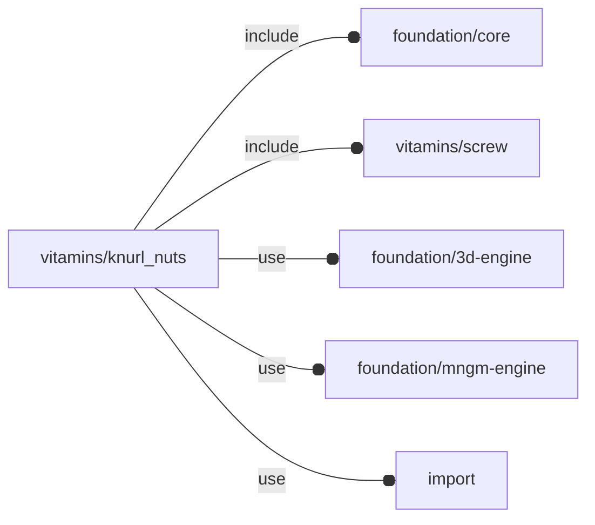

# package vitamins/knurl_nuts

## Dependencies



Knurl nuts (aka 'inserts') definition module.

Copyright © 2021, Giampiero Gabbiani (giampiero@gabbiani.org)

SPDX-License-Identifier: [GPL-3.0-or-later](https://spdx.org/licenses/GPL-3.0-or-later.html)


## Variables

---

### variable FL_KNUT_DICT

__Default:__

    [FL_KNUT_LINEAR_M2x4,FL_KNUT_LINEAR_M2x6,FL_KNUT_LINEAR_M2x8,FL_KNUT_LINEAR_M2x10,FL_KNUT_LINEAR_M3x4,FL_KNUT_LINEAR_M3x6,FL_KNUT_LINEAR_M3x8,FL_KNUT_LINEAR_M3x10,FL_KNUT_LINEAR_M4x4,FL_KNUT_LINEAR_M4x6,FL_KNUT_LINEAR_M4x8,FL_KNUT_LINEAR_M4x10,FL_KNUT_LINEAR_M5x6,FL_KNUT_LINEAR_M5x8,FL_KNUT_LINEAR_M5x10,FL_KNUT_SPIRAL_M2x4,FL_KNUT_SPIRAL_M2p5x5p7,FL_KNUT_SPIRAL_M3x5p7,FL_KNUT_SPIRAL_M4x8p1,FL_KNUT_SPIRAL_M5x9p5,FL_KNUT_SPIRAL_M6x12p7,FL_KNUT_SPIRAL_M8x12p7]

Dictionary sorted by increasing internal thread


---

### variable FL_KNUT_LINEAR_M2x10

__Default:__

    fl_knut_Linear(M2_cap_screw,10,3.5,0.5,[1.9,2.0,1.9])

Linear thread knurled nut M2x10mm

---

### variable FL_KNUT_LINEAR_M2x4

__Default:__

    fl_knut_Linear(M2_cap_screw,4,3.5,0.6,[1.15,1.15])

Linear thread knurled nut M2x4mm

---

### variable FL_KNUT_LINEAR_M2x6

__Default:__

    fl_knut_Linear(M2_cap_screw,6,3.5,0.6,[1.5,1.5])

Linear thread knurled nut M2x6mm

---

### variable FL_KNUT_LINEAR_M2x8

__Default:__

    fl_knut_Linear(M2_cap_screw,8,3.5,0.5,[1.3,1.4,1.3])

Linear thread knurled nut M2x8mm

---

### variable FL_KNUT_LINEAR_M3x10

__Default:__

    fl_knut_Linear(M3_cap_screw,10,5,0.5,[1.6,1.5,1.6])

Linear thread knurled nut M3x10mm

---

### variable FL_KNUT_LINEAR_M3x4

__Default:__

    fl_knut_Linear(M3_cap_screw,4,5,0.5,[1.2,1.2])

Linear thread knurled nut M3x4mm

---

### variable FL_KNUT_LINEAR_M3x6

__Default:__

    fl_knut_Linear(M3_cap_screw,6,5,0.5,[1.5,1.5])

Linear thread knurled nut M3x6mm

---

### variable FL_KNUT_LINEAR_M3x8

__Default:__

    fl_knut_Linear(M3_cap_screw,8,5,0.5,[1.9,1.9])

Linear thread knurled nut M3x8mm

---

### variable FL_KNUT_LINEAR_M4x10

__Default:__

    fl_knut_Linear(M4_cap_screw,10,6,0.5,[1.9,1.7,1.9])

Linear thread knurled nut M4x10mm

---

### variable FL_KNUT_LINEAR_M4x4

__Default:__

    fl_knut_Linear(M4_cap_screw,4,6,0.5,[1.3,1.3])

Linear thread knurled nut M4x4mm

---

### variable FL_KNUT_LINEAR_M4x6

__Default:__

    fl_knut_Linear(M4_cap_screw,6,6,0.5,[1.7,1.7])

Linear thread knurled nut M4x6mm

---

### variable FL_KNUT_LINEAR_M4x8

__Default:__

    fl_knut_Linear(M4_cap_screw,8,6,0.5,[2.3,2.3])

Linear thread knurled nut M4x8mm

---

### variable FL_KNUT_LINEAR_M5x10

__Default:__

    fl_knut_Linear(M5_cap_screw,10,7.0,0.8,[1.7,1.5,1.7])

Linear thread knurled nut M5x10mm

---

### variable FL_KNUT_LINEAR_M5x6

__Default:__

    fl_knut_Linear(M5_cap_screw,6,7.0,0.5,[1.9,1.9])

Linear thread knurled nut M5x6mm

---

### variable FL_KNUT_LINEAR_M5x8

__Default:__

    fl_knut_Linear(M5_cap_screw,8,7.0,0.5,[2.4,2.4])

Linear thread knurled nut M5x8mm

---

### variable FL_KNUT_LONGEST

__Default:__

    function(nuts)fl_max(nuts,function(item)fl_knut_thick(item))

in a list of knurl nuts find out the __longest__ one

---

### variable FL_KNUT_NOMINAL_DRILL

__Default:__

    [[2,[3.6,5.0,1.3]],[2.5,[4.0,6.7,1.6]],[3,[4.0,6.7,1.6]],[4,[5.6,9.1,2.1]],[5,[6.4,10.5,2.6]],[6,[8.0,13.7,3.3]],[8,[9.6,13.7,4.5]]]

table with nominal size and suggested corresponding drill diameter taken from https://www.ruthex.de/cdn/shop/files/Tabelle_DE_600x.jpg

| Metric ISO Thread | Inch UNC thread | hole ⌀ | min. hole length | min. hole wall |
| ----------------- | --------------- | ------ | ---------------- | -------------- |
| M2                | #2-56           | 3.6    |  5.0             | 1.3            |
| M2,5              |                 | 4.0    |  6.7             | 1.6            |
| M3                | #4-40           | 4.0    |  6.7             | 1.6            |
| M4                | #8-32           | 5.6    |  9.1             | 2.1            |
| M5                | #10-24          | 6.4    | 10.5             | 2.6            |
| M6                | ¼"-20           | 8.0    | 13.7             | 3.3            |
| M8                |                 | 9.6    | 13.7             | 4.5            |


---

### variable FL_KNUT_NS

__Default:__

    "knut"

namespace

---

### variable FL_KNUT_SHORTEST

__Default:__

    function(nuts)fl_min(nuts,function(item)fl_knut_thick(item))

in a list of knurl nuts find out the __shortest__ one

---

### variable FL_KNUT_SPIRAL_M2p5x5p7

__Default:__

    fl_knut_Spiral(M2p5_cap_screw,5.7,4.6,"vitamins/ruthex/rx-m2p5x5p7.stl")

Double spiral thread knurled nut M2.5x5.7mm

---

### variable FL_KNUT_SPIRAL_M2x4

__Default:__

    fl_knut_Spiral(M2_cap_screw,4,3.6,"vitamins/ruthex/rx-m2x4.stl")

Double spiral thread knurled nut M2x4mm

---

### variable FL_KNUT_SPIRAL_M3x5p7

__Default:__

    fl_knut_Spiral(M3_cap_screw,5.7,4.6,"vitamins/ruthex/rx-m3x5p7.stl")

Double spiral thread knurled nut M3x5.7mm

---

### variable FL_KNUT_SPIRAL_M4x8p1

__Default:__

    fl_knut_Spiral(M4_cap_screw,8.1,6.3,"vitamins/ruthex/rx-m4x8p1.stl")

Double spiral thread knurled nut M4x8.1mm

---

### variable FL_KNUT_SPIRAL_M5x9p5

__Default:__

    fl_knut_Spiral(M5_cap_screw,9.5,8.5,"vitamins/ruthex/rx-m5x9p5.stl")

Double spiral thread knurled nut M5x9.5mm

---

### variable FL_KNUT_SPIRAL_M6x12p7

__Default:__

    fl_knut_Spiral(M6_cap_screw,12.7,8.7,"vitamins/ruthex/rx-m6x12p7.stl")

Double spiral thread knurled nut M6x12.7mm

---

### variable FL_KNUT_SPIRAL_M8x12p7

__Default:__

    fl_knut_Spiral(M8_cap_screw,12.7,10.1,"vitamins/ruthex/rx-m8x12p7.stl")

Double spiral thread knurled nut M8x12.7mm

---

### variable FL_KNUT_TAG_LINEAR

__Default:__

    "linear thread"

---

### variable FL_KNUT_TAG_SPIRAL

__Default:__

    "double spiral thread"

## Functions

---

### function fl_knut_Linear

__Syntax:__

```text
fl_knut_Linear(screw,length,diameter,tooth,rings)
```

Constructor for Linear knurl nuts.

The diameter used during FL_DRILL is equal to:

    «external diameter» - 2 * «tooth» + 0.1mm


__Parameters:__

__screw__  
internal thread

__length__  
insert length

__diameter__  
external diameter

__tooth__  
tooth height

__rings__  
ring specification as a list of ring lengths


---

### function fl_knut_Spiral

__Syntax:__

```text
fl_knut_Spiral(screw,length,diameter,stl_file)
```

Constructor for double spiral knurl nuts.

The diameter used during FL_DRILL is taken from variable
FL_KNUT_NOMINAL_DRILL


__Parameters:__

__screw__  
internal thread

__length__  
insert length

__diameter__  
external diameter

__stl_file__  
stl geometry file from Ruthex


---

### function fl_knut_drillD

__Syntax:__

```text
fl_knut_drillD(type,value)
```

suggested drill diameter for FL_DRILL

---

### function fl_knut_nominal

__Syntax:__

```text
fl_knut_nominal(knut)
```

nominal diameter of the mounting screw

---

### function fl_knut_r

__Syntax:__

```text
fl_knut_r(type,value)
```

external radius, the internal radius being: [fl_knut_r()](#function-fl_knut_r)-[fl_knut_tooth()](#function-fl_knut_tooth)

---

### function fl_knut_rings

__Syntax:__

```text
fl_knut_rings(type,value)
```

rings array in the format '[[height1,position1],[height2,position2,..]]`

---

### function fl_knut_search

__Syntax:__

```text
fl_knut_search(screw,thick,d,tag,best=FL_KNUT_LONGEST)
```

Search into dictionary for the best matching knut (default behavior) or all
the matching knurl nuts.


__Parameters:__

__screw__  
screw to fit into: ignored if undef

__thick__  
max knurl nut thickness (along Z axis): ignored if undef

__d__  
nominal diameter: ignored if undef/zero

__tag__  
product tag: ignored if undef

__best__  
Lambda calculating the 'score' for determining the 'best' match.

The default returns the longest knurl nut.


---

### function fl_knut_teeth

__Syntax:__

```text
fl_knut_teeth(type,value)
```

teeth number

---

### function fl_knut_thick

__Syntax:__

```text
fl_knut_thick(type,value)
```

Z axis length

---

### function fl_knut_tooth

__Syntax:__

```text
fl_knut_tooth(type,value)
```

tooth height

## Modules

---

### module fl_knut

__Syntax:__

    fl_knut(verbs=FL_ADD,type,dri_thick=0,direction,octant)

__Parameters:__

__verbs__  
supported verbs: `FL_ADD, FL_AXES, FL_ASSEMBLY, FL_BBOX, FL_DRILL, FL_LAYOUT`

__dri_thick__  
List of Z-axis thickness for FL_DRILL operations or scalar value.

A positive value is for drill along +Z semi-axis.
A negative value is for drill along -Z semi-axis.
A scalar value is applied to both Z semi-axes.

Example 1:

    dri_thick = [+3,-1]

is interpreted as drill of 3mm along +Z and 1mm along -Z

Example 2:

    dri_thick = [-1]

is interpreted as drill of 1mm along -Z

Example 3:

    dri_thick = 2

is interpreted as a drill of 2mm along +Z and -Z axes


__direction__  
desired direction [director,rotation], native direction when undef ([+Z])

__octant__  
when undef native positioning is used


