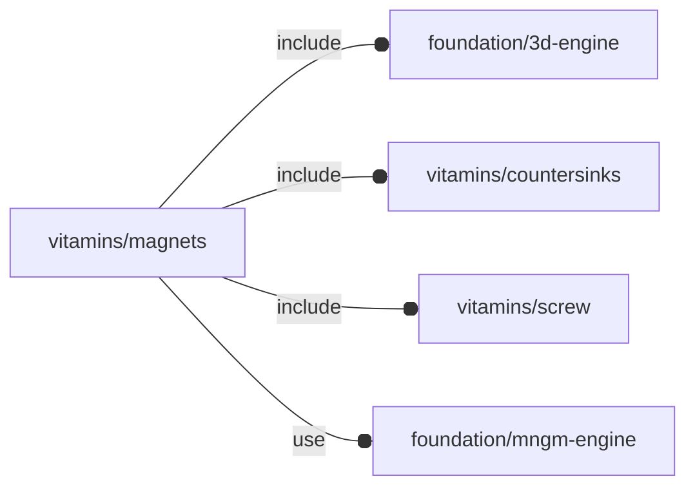

# package vitamins/magnets

## Dependencies



Magnets definitions.

Copyright © 2021, Giampiero Gabbiani (giampiero@gabbiani.org)

SPDX-License-Identifier: [GPL-3.0-or-later](https://spdx.org/licenses/GPL-3.0-or-later.html)


## Variables

---

### variable FL_MAG_D10x5

__Default:__

    fl_Magnet(name="mag_d10x5",description="magnet d10x5mm",d=10,thick=5,vendors=[["Amazon","https://www.amazon.it/gp/product/B017W7J0TA/"],])

---

### variable FL_MAG_DICT

__Default:__

    [FL_MAG_M3_CS_D10x2,FL_MAG_D10x5,FL_MAG_M3_CS_D10x5,FL_MAG_M4_CS_D32x6,FL_MAG_RECT_10x5x1,FL_MAG_RECT_10x5x2,]

---

### variable FL_MAG_M3_CS_D10x2

__Default:__

    fl_Magnet(name="mag_M3_cs_d10x2",description="M3 countersink magnet d10x2mm 1.2kg",d=10,thick=2,cs=FL_CS_UNI_M3,csh=2,screw=M3_cs_cap_screw,vendors=[["Amazon","https://www.amazon.it/gp/product/B007UOXRY0/"],])

---

### variable FL_MAG_M3_CS_D10x5

__Default:__

    fl_Magnet(name="mag_M3_cs_d10x5",description="M3 countersink magnet d10x5mm 2.0kg",d=10,thick=5,cs=FL_CS_UNI_M3,csh=3,screw=M3_cs_cap_screw,vendors=[["Amazon","https://www.amazon.it/gp/product/B001TOJESK/"],])

---

### variable FL_MAG_M4_CS_D32x6

__Default:__

    fl_Magnet(name="mag_M4_cs_d32x6",description="M4 countersink magnet d32x6mm 29.0kg",d=32,thick=6,cs=FL_CS_UNI_M3,csh=2,screw=M3_cs_cap_screw,vendors=[["Amazon","https://www.amazon.it/gp/product/B07RQL2ZSS/"],])

---

### variable FL_MAG_NS

__Default:__

    "mag"

namespace for pin headers engine

---

### variable FL_MAG_RECT_10x5x1

__Default:__

    fl_Magnet(name="mag_rect_10x5x1",description="rectangular magnet 10x5x1mm",size=[10,5,1],vendors=[["Amazon","https://www.amazon.it/gp/product/B06XQNG59T/"],])

---

### variable FL_MAG_RECT_10x5x2

__Default:__

    fl_Magnet(name="mag_rect_10x5x2",description="rectangular magnet 10x5x2mm",size=[10,5,2],vendors=[["Amazon","https://www.amazon.it/gp/product/B075PBJ31D/"],])

## Functions

---

### function fl_Magnet

__Syntax:__

```text
fl_Magnet(name,description,d,thick,size,cs,csh,screw,vendors)
```

constructor

---

### function fl_mag_cs

__Syntax:__

```text
fl_mag_cs(type,value)
```

---

### function fl_mag_csH

__Syntax:__

```text
fl_mag_csH(type,value)
```

---

### function fl_mag_d

__Syntax:__

```text
fl_mag_d(type,value)
```

---

### function fl_mag_engine

__Syntax:__

```text
fl_mag_engine(type,value)
```

## Modules

---

### module fl_magnet

__Syntax:__

    fl_magnet(verbs=FL_ADD,type,fp_gross=0,thick=0,screw,direction,octant)

__Parameters:__

__verbs__  
supported verbs: FL_ADD, FL_ASSEMBLY, FL_BBOX, FL_DRILL, FL_FOOTPRINT, FL_LAYOUT

__type__  
magnet object

__fp_gross__  
quantity to add to the footprint dimensions

__thick__  
thickness for screws

__screw__  
nominal screw overloading

__direction__  
desired direction [director,rotation], native direction when undef

__octant__  
when undef native positioning is used (+Z)


