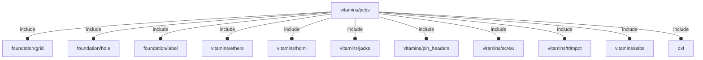

# package vitamins/pcbs

## System Context

## Variables

---

### variable FL_PCB_DICT

__Default:__

    [FL_PCB_HILETGO_SX1308,FL_PCB_MH4PU_P,FL_PCB_PERF70x50,FL_PCB_PERF60x40,FL_PCB_PERF70x30,FL_PCB_PERF80x20,FL_PCB_RPI4,FL_PCB_RPI_uHAT,]

---

### variable FL_PCB_HILETGO_SX1308

__Default:__

    let(pcb_t=1.6,sz=[23,16,pcb_t],holes=[for(x=[-sz.x/2+2.5,+sz.x/2-2.5],y=[-sz.y/2+2.5,+sz.y/2-2.5])[x,y,0]],1PIN=fl_PinHeader("1-pin",nop=2p54header,engine="male"),comps=[["TRIMPOT",[FL_TRIM_NS,[-5,-sz.y/2+0.5,0],[+Y,0],FL_TRIM_POT10,[["comp/octant",+X-Y+Z]]]],for(i=[0:len(holes)-1])let(label=str("PIN-",i))[label,[FL_PHDR_NS,holes[i],[+Z,0],1PIN]],])fl_PCB(name="HiLetgo SX1308 DC-DC Step up power module",bare=[[-sz.x/2,-sz.y/2,-sz.z],[+sz.x/2,+sz.y/2,0]],thick=pcb_t,color="DarkCyan",holes=let(r=0.75,d=r*2)[for(i=[0:len(holes)-1])let(pos=holes[i])fl_Hole(pos,d,+Z,0,loct=-sign(pos.x)*X-sign(pos.y)*Y)],components=comps,vendors=[["Amazon","https://www.amazon.it/gp/product/B07ZYW68C4"]])

---

### variable FL_PCB_MH4PU_P

__Default:__

    let(name="ORICO 4 Ports USB 3.0 Hub 5 Gbps with external power supply port",w=84,l=39,pcb_t=1.6,bare=[[-w/2,-l/2,-pcb_t],[+w/2,+l/2,0]],holes=[let(r=2)fl_Hole([-w/2+r+1,-l/2+r+2,0],2*r,+Z,pcb_t,loct=+Y),let(r=2)fl_Hole([+w/2-r-1,-l/2+r+2,0],2*r,+Z,pcb_t,loct=+Y),let(r=2)fl_Hole([-w/2+r+1,+l/2-r-2,0],2*r,+Z,pcb_t,loct=-Y),let(r=2)fl_Hole([+w/2-r-1,+l/2-r-2,0],2*r,+Z,pcb_t,loct=-Y),let(r=1.25)fl_Hole([-w/2+r+1,0,0],2*r,+Z,pcb_t,loct=+X,screw=M2p5_pan_screw),let(r=1.25)fl_Hole([+w/2-r-1,0,0],2*r,+Z,pcb_t,loct=-X,screw=M2p5_pan_screw),let(r=1.25)fl_Hole([-w/2+r+37.5+r,0,0],2*r,+Z,pcb_t,loct=+Y,screw=M2p5_pan_screw),],sz_A=fl_size(FL_USB_TYPE_Ax1),sz_uA=fl_size(FL_USB_TYPE_uA),tol=0.5,comps=[["USB3 IN",[FL_USB_NS,[-w/2+13.5,+l/2-6,-(pcb_t+1)],[+Y,0],FL_USB_TYPE_Ax1_NF,[["comp/sub",0.5],["comp/drift",-2.5],["comp/color","OrangeRed"]]]],["POWER IN",[FL_USB_NS,[+w/2-10,+l/2-sz_uA.x/2+0.5,0],[+Y,0],FL_USB_TYPE_uA_NF,[["comp/drift",-0.5]]]],["USB3-1",[FL_USB_NS,[+w/2-(6+tol+sz_A.y/2),-l/2+6,-(pcb_t+1)],[-Y,0],FL_USB_TYPE_Ax1_NF,[["comp/sub",tol],["comp/drift",-2.5],["comp/color","DodgerBlue"]]]],["USB3-2",[FL_USB_NS,[+w/2-(6+3*tol+3/2*sz_A.y+5),-l/2+6,-(pcb_t+1)],[-Y,0],FL_USB_TYPE_Ax1_NF,[["comp/sub",tol],["comp/drift",-2.5],["comp/color","DodgerBlue"]]]],["USB3-3",[FL_USB_NS,[-w/2+(6+3*tol+3/2*sz_A.y+5),-l/2+6,-(pcb_t+1)],[-Y,0],FL_USB_TYPE_Ax1_NF,[["comp/sub",tol],["comp/drift",-2.5],["comp/color","DodgerBlue"]]]],["USB3-4",[FL_USB_NS,[-w/2+(6+tol+sz_A.y/2),-l/2+6,-(pcb_t+1)],[-Y,0],FL_USB_TYPE_Ax1_NF,[["comp/sub",tol],["comp/drift",-2.5],["comp/color","DodgerBlue"]]]],],vendors=[["Amazon","https://www.amazon.it/gp/product/B07VQLXCTB"]])fl_PCB(name,bare,pcb_t,"DarkCyan",1,undef,holes,comps,undef,M3_cap_screw,vendors=vendors)

---

### variable FL_PCB_NS

__Default:__

    "pcb"

---

### variable FL_PCB_PERF60x40

__Default:__

    fl_pcb_import(PERF60x40)

---

### variable FL_PCB_PERF70x30

__Default:__

    fl_pcb_import(PERF70x30)

---

### variable FL_PCB_PERF70x50

__Default:__

    fl_pcb_import(PERF70x50)

---

### variable FL_PCB_PERF80x20

__Default:__

    fl_pcb_import(PERF80x20)

---

### variable FL_PCB_RPI4

__Default:__

    let(w=56,l=85,h=16,pcb_t=1.5,hole_d=2.7,bare=[[-w/2,0,-pcb_t],[+w/2,l,0]],payload=[[bare[0].x,bare[0].y,0],[bare[1].x,bare[1].y,h]],holes=[fl_Hole([24.5,3.5,0],hole_d,depth=pcb_t,loct=-X),fl_Hole([24.5,61.5,0],hole_d,+Z,pcb_t,loct=+Y),fl_Hole([-24.5,3.5,0],hole_d,+Z,pcb_t,loct=+X),fl_Hole([-24.5,61.5,0],hole_d,+Z,pcb_t,loct=+Y),],comps=[["POWER IN",[FL_USB_NS,[25.5,11.2,0],[+X,0],FL_USB_TYPE_C,[["comp/drift",-1.3]]]],["HDMI0",[FL_HDMI_NS,[25,26,0],[+X,0],FL_HDMI_TYPE_D,[["comp/drift",-1.26]]]],["HDMI1",[FL_HDMI_NS,[25,39.5,0],[+X,0],FL_HDMI_TYPE_D,[["comp/drift",-1.26]]]],["A/V",[FL_JACK_NS,[22,54,0],[+X,0],FL_JACK_BARREL]],["USB2",[FL_USB_NS,[w/2-9,79.5,0],[+Y,0],FL_USB_TYPE_Ax2,[["comp/drift",-3]]]],["USB3",[FL_USB_NS,[w/2-27,79.5,0],[+Y,0],FL_USB_TYPE_Ax2,[["comp/drift",-3]]]],["ETHERNET",[FL_ETHER_NS,[w/2-45.75,77.5,0],[+Y,0],FL_ETHER_RJ45,[["comp/drift",-3]]]],["GPIO",[FL_PHDR_NS,[-w/2+3.5,32.5,0],[+Z,90],FL_PHDR_GPIOHDR]],],vendors=[["Amazon","https://www.amazon.it/gp/product/B0899VXM8F"]],gpio_c=fl_comp_connectors(comps[7][1])[0],conns=[fl_conn_clone(gpio_c,type="plug",direction=[+Z,-90],octant=-X-Y),])fl_PCB("RPI4-MODBP-8GB",bare,pcb_t,"green",3,undef,holes,comps,undef,M3_cap_screw,vendors=vendors,connectors=conns)

---

### variable FL_PCB_RPI_uHAT

__Default:__

    let(pcb_t=1.6,size=[65,30,pcb_t],bare=[[0,0,-pcb_t],[size.x,size.y,0]],hole_d=2.75,holes=[fl_Hole([3.5,size.y-3.5,0],hole_d,+Z,pcb_t,loct=-Y),fl_Hole([size.x-3.5,size.y-3.5,0],hole_d,+Z,pcb_t,loct=-Y),fl_Hole([size.x-3.5,3.5,0],hole_d,+Z,pcb_t,loct=+Y),],comps=[["RF IN",[FL_JACK_NS,[0,15,0],[-X,0],FL_JACK_MCXJPHSTEM1]],["GPIO",[FL_PHDR_NS,[32.5,size.y-3.5,0],[+Z,0],FL_PHDR_GPIOHDR_F_SMT_LOW]],],vendors=[["Amazon","https://www.amazon.it/gp/product/B07JKH36VR"]],gpio_conn_pos=fl_conn_pos(fl_comp_connectors(comps[1][1])[1]),rf_conn_pos=fl_conn_pos(fl_comp_connectors(comps[0][1])[0]),connectors=[conn_Socket(fl_phdr_cid(2p54header,[20,2]),+X,+Y,[gpio_conn_pos.x,gpio_conn_pos.y,-pcb_t],octant=+X+Y,direction=[-Z,180]),conn_Socket(fl_phdr_cid(2p54header,[20,2]),-X,+Y,[gpio_conn_pos.x,gpio_conn_pos.y,4],octant=+X+Y,direction=[-Z,0]),conn_Socket("antenna",-Z,+Y,rf_conn_pos,octant=+X+Y,direction=[-Z,-90]),])fl_PCB("Raspberry PI uHAT",bare,pcb_t,"green",radius=3,dxf="vitamins/tv-hat.dxf",screw=M2p5_cap_screw,holes=holes,components=comps,vendors=vendors,connectors=connectors)

## Functions

---

### function fl_PCB

__Syntax:__

    fl_PCB(name,bare,thick=1.6,color="green",radius=0,payload,holes=[],components,grid,screw,dxf,vendors,connectors,director=+Z,rotor=+X)

---

### function fl_comp_BBox

__Syntax:__

    fl_comp_BBox(spec_list)

---

### function fl_comp_connectors

__Syntax:__

    fl_comp_connectors(component)

---

### function fl_comp_search

__Syntax:__

    fl_comp_search(type,label,comps)

returns the component with «label»
NOTE: error when label is not unique

---

### function fl_grid_geometry

__Syntax:__

    fl_grid_geometry(grid,size)

---

### function fl_pcb_NopHoles

__Syntax:__

    fl_pcb_NopHoles(nop)

---

### function fl_pcb_components

__Syntax:__

    fl_pcb_components(type,value)

---

### function fl_pcb_grid

__Syntax:__

    fl_pcb_grid(type,value)

---

### function fl_pcb_import

__Syntax:__

    fl_pcb_import(nop,payload)

---

### function fl_pcb_radius

__Syntax:__

    fl_pcb_radius(type,value)

---

### function fl_pcb_thick

__Syntax:__

    fl_pcb_thick(type,value)

## Modules

---

### module fl_comp_Context

__Syntax:__

    fl_comp_Context(component)

---

### module fl_comp_Specs

__Syntax:__

    fl_comp_Specs(specs)

---

### module fl_pcb

__Syntax:__

    fl_pcb(verbs=FL_ADD,type,cut_tolerance=0,cut_label,cut_direction,thick=0,lay_direction=[+Z],debug,direction,octant)

---

### module fl_pcb_adapter

__Syntax:__

    fl_pcb_adapter(verbs=FL_ADD,type,thick=0,payload,direction,octant)

