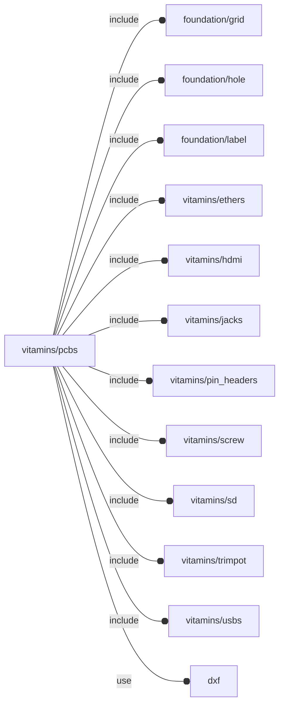

# package vitamins/pcbs

## Dependencies



PCB definition file.

Copyright © 2021, Giampiero Gabbiani (giampiero@gabbiani.org)

SPDX-License-Identifier: [GPL-3.0-or-later](https://spdx.org/licenses/GPL-3.0-or-later.html)


## Variables

---

### variable FL_PCB_DICT

__Default:__

    [FL_PCB_HILETGO_SX1308,FL_PCB_MH4PU_P,FL_PCB_PERF70x50,FL_PCB_PERF60x40,FL_PCB_PERF70x30,FL_PCB_PERF80x20,FL_PCB_RPI4,FL_PCB_RPI_uHAT,]

---

### variable FL_PCB_HILETGO_SX1308

__Default:__

    let(pcb_t=1.6,sz=[23,16,pcb_t],holes=[for(x=[-sz.x/2+2.5,+sz.x/2-2.5],y=[-sz.y/2+2.5,+sz.y/2-2.5])[x,y,0]],1PIN=fl_PinHeader("1-pin",nop=2p54header,engine="male"),comps=[["TRIMPOT",[FL_TRIM_NS,[-5,-sz.y/2+0.5,0],[+Y,0],FL_TRIM_POT10,[["comp/octant",+X-Y+Z]]]],for(i=[0:len(holes)-1])let(label=str("PIN-",i))[label,[FL_PHDR_NS,holes[i],[+Z,0],1PIN]],])fl_PCB(name="HiLetgo SX1308 DC-DC Step up power module",bare=[[-sz.x/2,-sz.y/2,-sz.z],[+sz.x/2,+sz.y/2,0]],thick=pcb_t,color="DarkCyan",holes=let(r=0.75,d=r*2)[for(i=[0:len(holes)-1])let(pos=holes[i])fl_Hole(pos,d,+Z,0,loct=-sign(pos.x)*X-sign(pos.y)*Y)],components=comps,vendors=[["Amazon","https://www.amazon.it/gp/product/B07ZYW68C4"]])

---

### variable FL_PCB_MH4PU_P

__Default:__

    let(name="ORICO 4 Ports USB 3.0 Hub 5 Gbps with external power supply port",w=84,l=39,pcb_t=1.6,bare=[[-w/2,-l/2,-pcb_t],[+w/2,+l/2,0]],holes=[let(r=2)fl_Hole([-w/2+r+1,-l/2+r+2,0],2*r,+Z,pcb_t,loct=+Y),let(r=2)fl_Hole([+w/2-r-1,-l/2+r+2,0],2*r,+Z,pcb_t,loct=+Y),let(r=2)fl_Hole([-w/2+r+1,+l/2-r-2,0],2*r,+Z,pcb_t,loct=-Y),let(r=2)fl_Hole([+w/2-r-1,+l/2-r-2,0],2*r,+Z,pcb_t,loct=-Y),let(r=1.25)fl_Hole([-w/2+r+1,0,0],2*r,+Z,pcb_t,loct=+X,screw=M2p5_pan_screw),let(r=1.25)fl_Hole([+w/2-r-1,0,0],2*r,+Z,pcb_t,loct=-X,screw=M2p5_pan_screw),let(r=1.25)fl_Hole([-w/2+r+37.5+r,0,0],2*r,+Z,pcb_t,loct=+Y,screw=M2p5_pan_screw),],sz_A=fl_size(FL_USB_TYPE_Ax1),sz_uA=fl_size(FL_USB_TYPE_uA),tol=0.5,comps=[["USB3 IN",[FL_USB_NS,[-w/2+13.5,+l/2-6,-(pcb_t+1)],[+Y,0],FL_USB_TYPE_Ax1_NF,[["comp/sub",0.5],["comp/drift",-2.5],["comp/color","OrangeRed"]]]],["POWER IN",[FL_USB_NS,[+w/2-10,+l/2-sz_uA.x/2+0.5,0],[+Y,0],FL_USB_TYPE_uA_NF,[["comp/drift",-0.5]]]],["USB3-1",[FL_USB_NS,[+w/2-(6+tol+sz_A.y/2),-l/2+6,-(pcb_t+1)],[-Y,0],FL_USB_TYPE_Ax1_NF,[["comp/sub",tol],["comp/drift",-2.5],["comp/color","DodgerBlue"]]]],["USB3-2",[FL_USB_NS,[+w/2-(6+3*tol+3/2*sz_A.y+5),-l/2+6,-(pcb_t+1)],[-Y,0],FL_USB_TYPE_Ax1_NF,[["comp/sub",tol],["comp/drift",-2.5],["comp/color","DodgerBlue"]]]],["USB3-3",[FL_USB_NS,[-w/2+(6+3*tol+3/2*sz_A.y+5),-l/2+6,-(pcb_t+1)],[-Y,0],FL_USB_TYPE_Ax1_NF,[["comp/sub",tol],["comp/drift",-2.5],["comp/color","DodgerBlue"]]]],["USB3-4",[FL_USB_NS,[-w/2+(6+tol+sz_A.y/2),-l/2+6,-(pcb_t+1)],[-Y,0],FL_USB_TYPE_Ax1_NF,[["comp/sub",tol],["comp/drift",-2.5],["comp/color","DodgerBlue"]]]],],vendors=[["Amazon","https://www.amazon.it/gp/product/B07VQLXCTB"]])fl_PCB(name,bare,pcb_t,"DarkCyan",1,undef,holes,comps,undef,M3_cap_screw,vendors=vendors)

---

### variable FL_PCB_NS

__Default:__

    "pcb"

namespace for PCB engine

---

### variable FL_PCB_PERF60x40

__Default:__

    fl_pcb_import(PERF60x40)

---

### variable FL_PCB_PERF70x30

__Default:__

    fl_pcb_import(PERF70x30)

---

### variable FL_PCB_PERF70x50

__Default:__

    fl_pcb_import(PERF70x50)

---

### variable FL_PCB_PERF80x20

__Default:__

    fl_pcb_import(PERF80x20)

---

### variable FL_PCB_RPI4

__Default:__

    let(w=56,l=85,h=16,pcb_t=1.5,hole_d=2.7,bare=[[-w/2,0,-pcb_t],[+w/2,l,0]],payload=[[bare[0].x,bare[0].y,0],[bare[1].x,bare[1].y,h]],holes=[fl_Hole([24.5,3.5,0],hole_d,depth=pcb_t,loct=-X),fl_Hole([24.5,61.5,0],hole_d,+Z,pcb_t,loct=+Y),fl_Hole([-24.5,3.5,0],hole_d,+Z,pcb_t,loct=+X),fl_Hole([-24.5,61.5,0],hole_d,+Z,pcb_t,loct=+Y),],comps=[["POWER IN",[FL_USB_NS,[25.5,11.2,0],[+X,0],FL_USB_TYPE_C,[["comp/drift",-1.3]]]],["HDMI0",[FL_HDMI_NS,[25,26,0],[+X,0],FL_HDMI_TYPE_D,[["comp/drift",-1.26]]]],["HDMI1",[FL_HDMI_NS,[25,39.5,0],[+X,0],FL_HDMI_TYPE_D,[["comp/drift",-1.26]]]],["A/V",[FL_JACK_NS,[22,54,0],[+X,0],FL_JACK_BARREL]],["USB2",[FL_USB_NS,[w/2-9,79.5,0],[+Y,0],FL_USB_TYPE_Ax2,[["comp/drift",-3]]]],["USB3",[FL_USB_NS,[w/2-27,79.5,0],[+Y,0],FL_USB_TYPE_Ax2,[["comp/drift",-3]]]],["ETHERNET",[FL_ETHER_NS,[w/2-45.75,77.5,0],[+Y,0],FL_ETHER_RJ45,[["comp/drift",-3]]]],["GPIO",[FL_PHDR_NS,[-w/2+3.5,32.5,0],[+Z,90],FL_PHDR_GPIOHDR]],["uSD",[FL_SD_NS,[0,2,-pcb_t],[-Y,180],FL_SD_MOLEX_uSD_SOCKET,[["comp/octant",+Y+Z],["comp/drift",2]]]],],vendors=[["Amazon","https://www.amazon.it/gp/product/B0899VXM8F"]],gpio_c=fl_comp_connectors(comps[7][1])[0],conns=[fl_conn_clone(gpio_c,type="plug",direction=[+Z,-90],octant=-X-Y),])fl_PCB("RPI4-MODBP-8GB",bare,pcb_t,"green",3,undef,holes,comps,undef,M3_cap_screw,vendors=vendors,connectors=conns)

Model for Raspberry PI 4.
The following labels can be passed as **cut_label** parameter to [fl_pcb{}](#module-fl_pcb) when performing FL_CUTOUT:

| Label      | Description                                   |
|------------|-----------------------------------------------|
| "POWER IN" | 5V DC via USB-C connector                     |
| "HDMI0"    | micro-HDMI port 0                             |
| "HDMI1"    | micro-HDMI port 1                             |
| "A/V"      | 4-pole stereo audio and composite video port  |
| "USB2"     | USB 2.0 port                                  |
| "USB3"     | USB 3.0 port                                  |
| "ETHERNET" | Gigabit Ethernet                              |
| "GPIO"     | Raspberry Pi standard 40 pin GPIO header      |
| "uSD"      | Micro-SD card slot                            |


---

### variable FL_PCB_RPI_uHAT

__Default:__

    let(pcb_t=1.6,size=[65,30,pcb_t],bare=[[0,0,-pcb_t],[size.x,size.y,0]],hole_d=2.75,holes=[fl_Hole([3.5,size.y-3.5,0],hole_d,+Z,pcb_t,loct=-Y),fl_Hole([size.x-3.5,size.y-3.5,0],hole_d,+Z,pcb_t,loct=-Y),fl_Hole([size.x-3.5,3.5,0],hole_d,+Z,pcb_t,loct=+Y),],comps=[["RF IN",[FL_JACK_NS,[0,15,0],[-X,0],FL_JACK_MCXJPHSTEM1]],["GPIO",[FL_PHDR_NS,[32.5,size.y-3.5,0],[+Z,0],FL_PHDR_GPIOHDR_F_SMT_LOW]],],vendors=[["Amazon","https://www.amazon.it/gp/product/B07JKH36VR"]],gpio_conn_pos=fl_conn_pos(fl_comp_connectors(comps[1][1])[1]),rf_conn_pos=fl_conn_pos(fl_comp_connectors(comps[0][1])[0]),connectors=[conn_Socket(fl_phdr_cid(2p54header,[20,2]),+X,+Y,[gpio_conn_pos.x,gpio_conn_pos.y,-pcb_t],octant=+X+Y,direction=[-Z,180]),conn_Socket(fl_phdr_cid(2p54header,[20,2]),-X,+Y,[gpio_conn_pos.x,gpio_conn_pos.y,4],octant=+X+Y,direction=[-Z,0]),conn_Socket("antenna",-Z,+Y,rf_conn_pos,octant=+X+Y,direction=[-Z,-90]),])fl_PCB("Raspberry PI uHAT",bare,pcb_t,"green",radius=3,dxf="vitamins/tv-hat.dxf",screw=M2p5_cap_screw,holes=holes,components=comps,vendors=vendors,connectors=connectors)

PCB RF cutout taken from https://www.rfconnector.com/mcx/edge-mount-jack-pcb-connector

The following labels can be passed as **cut_label** parameter to [fl_pcb{}](#module-fl_pcb) when performing FL_CUTOUT:

| Label      | Description                             |
|------------|-----------------------------------------|
| "RF IN"  | Antenna connector                         |
| "GPIO"   | Raspberry Pi standard 40 pin GPIO header  |


## Functions

---

### function fl_PCB

__Syntax:__

```text
fl_PCB(name,bare,thick=1.6,color="green",radius=0,payload,holes=[],components,grid,screw,dxf,vendors,connectors,director=+Z,rotor=+X)
```

base constructor

__Parameters:__

__bare__  
bare (i.e. no payload) pcb's bounding box

__thick__  
pcb thickness

__radius__  
corners radius

__payload__  
Optional payload bounding box.
When passed it concurs in pcb's bounding box calculations


__holes__  
each row represents a hole with the following format:

`[[point],[normal], diameter, thickness]`


__components__  
each row represent one component with the following format:

`["label", ["engine", [position], [[director],rotation] type],subtract]`


__grid__  
grid specs


---

### function fl_comp_BBox

__Syntax:__

```text
fl_comp_BBox(spec_list)
```

exact calculation of the resulting bounding box out of a list of component specifications

---

### function fl_comp_connectors

__Syntax:__

```text
fl_comp_connectors(component)
```

returns «component» connectors transformed according to component position/orientation


---

### function fl_comp_search

__Syntax:__

```text
fl_comp_search(type,label,comps)
```

returns the component with «label»

:memo: **NOTE:** error when label is not unique


---

### function fl_pcb_NopHoles

__Syntax:__

```text
fl_pcb_NopHoles(nop)
```

Helper for conversion from NopSCADlib hole format to OFL.


---

### function fl_pcb_components

__Syntax:__

```text
fl_pcb_components(type,value)
```

---

### function fl_pcb_grid

__Syntax:__

```text
fl_pcb_grid(type,value)
```

---

### function fl_pcb_import

__Syntax:__

```text
fl_pcb_import(nop,payload)
```

PCB constructor from NopSCADlib.

Only basic PCB attributes are imported from NopSCADlib types:

 - sizing
 - material
 - holes
 - screw
 - grid

:warning: **WARNING:** no component is currently imported. still a work in progress
use [fl_pcb_adapter{}](#module-fl_pcb_adapter) instead.

TODO: fix and complete


---

### function fl_pcb_radius

__Syntax:__

```text
fl_pcb_radius(type,value)
```

---

### function fl_pcb_thick

__Syntax:__

```text
fl_pcb_thick(type,value)
```

## Modules

---

### module fl_comp_Context

__Syntax:__

    fl_comp_Context(component)

Component context:

 - $engine    : engine to be triggered for component rendering
 - $position  : component position
 - $direction
 - $director
 - $rotation
 - $type
 - $subtract  : the tolerance to be used during component FL_FOOTPRINT difference from parent shape
 - $drift     : additional positioning during component positioning
 - $color
 - $octant

TODO: prepend component namespace to context variable name


__Parameters:__

__component__  
component definition: ["engine", [position], [[director],rotation], type, properties]


---

### module fl_comp_Specs

__Syntax:__

    fl_comp_Specs(specs)

Component specifications context:

 - $label
 - $component

plus component context (see [fl_comp_Context{}](#module-fl_comp_context))


__Parameters:__

__specs__  
component specifications: ["label",component]


---

### module fl_pcb

__Syntax:__

    fl_pcb(verbs=FL_ADD,type,cut_tolerance=0,cut_label,cut_direction,thick=0,lay_direction=[+Z],debug,direction,octant)

PCB engine.

__parent context__:

- $hole_syms - (OPTIONAL bool) enables hole symbles

__children context__:

- complete hole context
- $pcb_radius - pcb radius


__Parameters:__

__verbs__  
FL_ADD, FL_ASSEMBLY, FL_AXES, FL_BBOX, FL_CUTOUT, FL_DRILL, FL_LAYOUT, FL_PAYLOAD

__cut_tolerance__  
FL_CUTOUT tolerance

__cut_label__  
FL_CUTOUT component filter by label. For the possible values consult the relevant «type» supported labels.

__cut_direction__  
FL_CUTOUT component filter by direction (+X,+Y or +Z)

__thick__  
FL_DRILL and FL_CUTOUT thickness in fixed form [[-X,+X],[-Y,+Y],[-Z,+Z]] or scalar shortcut

__lay_direction__  
FL_LAYOUT,FL_ASSEMBLY directions in floating semi-axis list form

__debug__  
see constructor [fl_parm_Debug()](../foundation/base_parameters.md#function-fl_parm_debug)

__direction__  
desired direction [director,rotation], native direction when undef

__octant__  
when undef native positioning is used


---

### module fl_pcb_adapter

__Syntax:__

    fl_pcb_adapter(verbs=FL_ADD,type,thick=0,payload,direction,octant)

PCB adapter for NopSCADlib.

While full attributes rendering is supported via NopSCADlib APIs, only basic
support is provided to OFL verbs, sometimes even with different behaviour:

- FL_ADD       : being impossible to render NopSCADlib pcbs without components,
                 this verb always renders components too;
- FL_ASSEMBLY  : only screws are added during assembly, since
                 components are always rendered during FL_ADD;
- FL_AXES      : no changes;
- FL_BBOX      : while OFL native PCBs includes also components sizing in
                 bounding box calculations, the adapter bounding box is
                 'reduced' to pcb only. The only way to mimic OFL native
                 behaviour is to explicity add the payload capacity through
                 the «payload» parameter.
- FL_CUTOUT    : always applied to all the components, it's not possible to
                 reduce component triggering by label nor direction.
                 No cutout tolerance is provided either;
- FL_DRILL     : no changes
- FL_LAYOUT    : no changes
- FL_PAYLOAD   : unsupported by native OFL PCBs

Others:

- Placement    : working with the FL_BBOX limitations
- Orientation  : no changes


__Parameters:__

__verbs__  
FL_ADD, FL_ASSEMBLY, FL_AXES, FL_BBOX, FL_CUTOUT, FL_DRILL, FL_LAYOUT, FL_PAYLOAD

__thick__  
FL_DRILL thickness in fixed form [[-X,+X],[-Y,+Y],[-Z,+Z]] or scalar shortcut

__payload__  
pay-load bounding box, is added to the overall bounding box calculation

__direction__  
desired direction [director,rotation], native direction when undef

__octant__  
when undef native positioning is used


