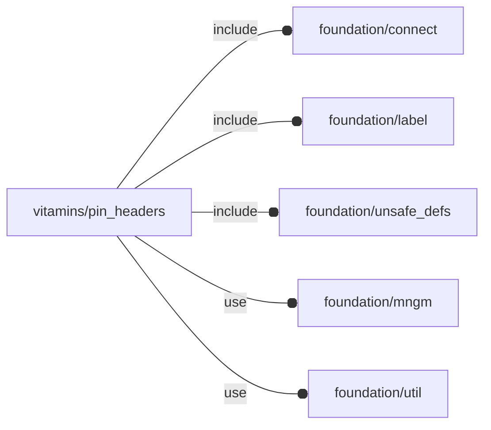

# package vitamins/pin_headers

## Dependencies



NopSCADlib pin header wrapper definitions.

Copyright © 2021, Giampiero Gabbiani (giampiero@gabbiani.org)

SPDX-License-Identifier: [GPL-3.0-or-later](https://spdx.org/licenses/GPL-3.0-or-later.html)


## Variables

---

### variable FL_PHDR_DICT

__Default:__

    [FL_PHDR_GPIOHDR,FL_PHDR_GPIOHDR_F,FL_PHDR_GPIOHDR_FL,FL_PHDR_GPIOHDR_F_SMT_LOW,]

---

### variable FL_PHDR_GPIOHDR

__Default:__

    fl_PinHeader(name="FL_PHDR_GPIOHDR",description="GPIO pin header",nop=2p54header,geometry=[20,2],engine="male")

---

### variable FL_PHDR_GPIOHDR_F

__Default:__

    fl_PinHeader(name="FL_PHDR_GPIOHDR_F",description="GPIO female pin header",nop=2p54header,geometry=[20,2],engine="female")

---

### variable FL_PHDR_GPIOHDR_FL

__Default:__

    let(nop=["2p54long",2.54,19.6,11,0.66,gold,grey(20),8.6,[0,0,8.7],2.4,0,0,0])fl_PinHeader(name="FL_PHDR_GPIOHDR_FL",description="GPIO female long pin header",nop=nop,geometry=[20,2],engine="female",vendors=[["amazon.it","https://www.amazon.it/gp/product/B08G8M9WX7"]])

---

### variable FL_PHDR_GPIOHDR_F_SMT_LOW

__Default:__

    let(nop=["2p54smtlow",2.54,4,0,0.66,gold,grey(20),4,[0,0,8.7],2.4,0,0,0])fl_PinHeader(name="FL_PHDR_GPIOHDR_F_SMT_LOW",description="GPIO female low pin pass-through header",nop=nop,geometry=[20,2],smt=true,engine="female",through=true)

---

### variable FL_PHDR_NS

__Default:__

    "phdr"

namespace for pin headers engine

## Functions

---

### function fl_PinHeader

__Syntax:__

```text
fl_PinHeader(name,description,nop,geometry=[1,1],smt=false,engine,through=false,vendors=[])
```

PinHeader constructor

__Parameters:__

__description__  
optional description string

__nop__  
NopSCADlib base type

__geometry__  
pin header size in [cols,rows]

__smt__  
smt

__engine__  
"female" or "male"

__through__  
pass-through (in that case pin numbers are inverted)

__vendors__  
vendor list


---

### function fl_bb_nopPinHeader

__Syntax:__

```text
fl_bb_nopPinHeader(nop,geometry,engine)
```

return the nop bounding box from its geometry

__Parameters:__

__nop__  
NopSCADlib pin header

__geometry__  
pin header size in [cols,rows]

__engine__  
can be "female" or "male"


---

### function fl_phdr_cid

__Syntax:__

```text
fl_phdr_cid(nop,geometry)
```

---

### function fl_phdr_geometry

__Syntax:__

```text
fl_phdr_geometry(type,value)
```

---

### function fl_phdr_nopSize

__Syntax:__

```text
fl_phdr_nopSize(nop,geometry,engine)
```

return the nop size from its geometry

__Parameters:__

__nop__  
NopSCADlib pin header

__geometry__  
pin header size in [cols,rows]

__engine__  
"female" or "male"


## Modules

---

### module fl_pinHeader

__Syntax:__

    fl_pinHeader(verbs=FL_ADD,type,color,cut_thick,cut_tolerance=0,debug,octant,direction,debug)

Pin headers engine.


__Parameters:__

__verbs__  
supported verbs: FL_ADD, FL_BBOX, FL_CUTOUT

__cut_thick__  
thickness for FL_CUTOUT

__cut_tolerance__  
tolerance used during FL_CUTOUT

__debug__  
see constructor [fl_parm_Debug()](../foundation/core.md#function-fl_parm_debug)

__octant__  
when undef native positioning is used

__direction__  
desired direction [director,rotation], native direction when undef


