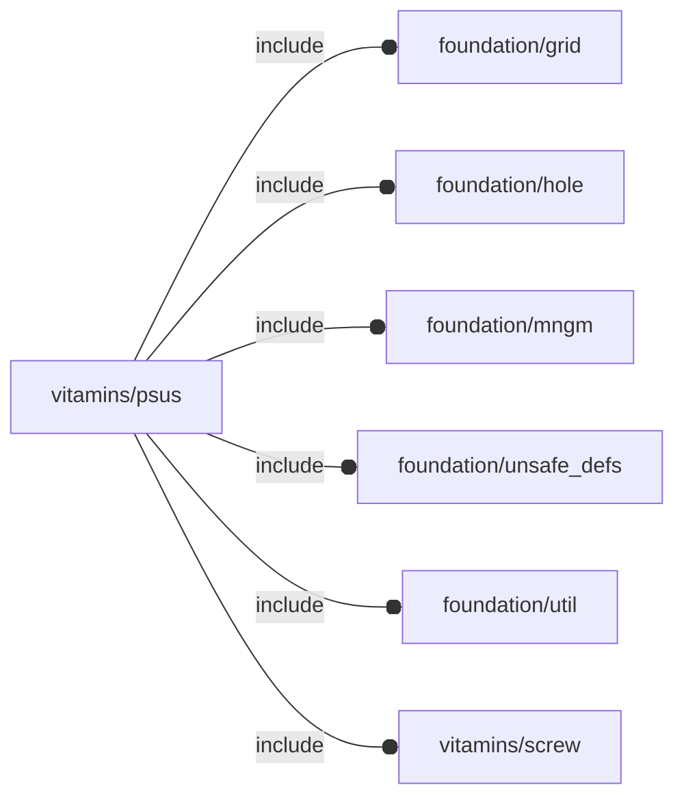

# package vitamins/psus

## Dependencies

PSU vitamin definitions.

Copyright © 2021, Giampiero Gabbiani (giampiero@gabbiani.org)

SPDX-License-Identifier: [GPL-3.0-or-later](https://spdx.org/licenses/GPL-3.0-or-later.html)

## Variables

---

### variable FL_PSU_DICT

__Default:__

    [FL_PSU_MeanWell_RS_25_5,FL_PSU_MeanWell_RS_15_5,]

---

### variable FL_PSU_MeanWell_RS_15_5

__Default:__

    let(size=[51,62.5,28],pcb_t=1.6,t=1,term_ways=5,term_step=7.62,term_esz=[1.62,11,12],bbox=[[-size.x/2,-term_esz.y,0],[+size.x/2,size.y,size.z],])[["name","PSU MeanWell RS-15-5 15W 5V 3A"],fl_engine(value=FL_PSU_NS),fl_bb_corners(value=bbox),fl_screw(value=M3_cs_cap_screw),["pcb thickness",pcb_t],["terminal screw",M3_pan_screw],["terminal ways",term_ways],["terminal step",term_step],["terminal edge size",term_esz],["grid diameter",4.4],["grid diagonal delta",1.6],["grid thickness",t],["grid surfaces",[[-FL_X,[size.z,size.y,t]],[+FL_Z,[size.x,size.y,t]],[+FL_Y,[size.x,size.z,t]],[-FL_Y,[size.x,9,t]],[+FL_X,[size.z,size.y,t]],[-FL_Z,[size.x,size.y,t]],]],fl_holes(value=[fl_Hole([size.x/2,11.9,15.1],3,+X,pcb_t),fl_Hole([size.x/2,size.x,15.1],3,+X,pcb_t),fl_Hole([0,8.75,0],3,-Z,pcb_t),fl_Hole([0,47.85,0],3,-Z,pcb_t),fl_Hole([-size.x/2+6.2,size.y,10],3,+Y,pcb_t),]),fl_vendor(value=[["Amazon","https://www.amazon.it/gp/product/B00MWQD43U/"],]),fl_director(value=-FL_Y),fl_rotor(value=-FL_X),]

---

### variable FL_PSU_MeanWell_RS_25_5

__Default:__

    let(size=[51,78,28],pcb_t=1.6,t=1,term_ways=5,term_step=7.62,term_esz=[1.62,11,12],bbox=[[-size.x/2,-term_esz.y,0],[+size.x/2,size.y,size.z],])[["name","PSU MeanWell RS-25-5 25W 5V 5A"],fl_engine(value=FL_PSU_NS),fl_bb_corners(value=bbox),fl_screw(value=M3_cs_cap_screw),["pcb thickness",pcb_t],["terminal screw",M3_pan_screw],["terminal ways",term_ways],["terminal step",term_step],["terminal edge size",term_esz],["grid diameter",4.4],["grid diagonal delta",1.6],["grid thickness",t],["grid surfaces",[[-FL_X,[size.z,size.y,t]],[+FL_Z,[size.x,size.y,t]],[+FL_Y,[size.x,size.z,t]],[-FL_Y,[size.x,9,t]],[+FL_X,[size.z,size.y,t]],[-FL_Z,[size.x,size.y,t]],]],fl_holes(value=[fl_Hole([25.5,8.75,14],3,+X,pcb_t),fl_Hole([25.5,75,14],3,+X,pcb_t),fl_Hole([0,12,0],3,-Z,pcb_t),fl_Hole([0,67,0],3,-Z,pcb_t),fl_Hole([-size.x/2+6.2,size.y,10],3,+Y,pcb_t),]),fl_vendor(value=[["Amazon","https://www.amazon.it/gp/product/B00MWQDAMU/"],]),fl_director(value=-FL_Y),fl_rotor(value=-FL_X),]

---

### variable FL_PSU_NS

__Default:__

    "psu"

namespace for PSU engine

## Modules

---

### module fl_psu

__Syntax:__

    fl_psu(verbs,type,thick=0,lay_direction=[+X,+Y,-Z],direction,octant)

__Parameters:__

__verbs__  
MANDATORY verb or list of verbs

__type__  
MANDATORY

__thick__  
FL_DRILL thickness in fixed form [[-X,+X],[-Y,+Y],[-Z,+Z]] or scalar shortcut

__lay_direction__  
FL_LAYOUT directions in floating semi-axis list form

__direction__  
desired direction [director,rotation], native direction when undef ([+X+Y+Z])

__octant__  
when undef native positioning is used

