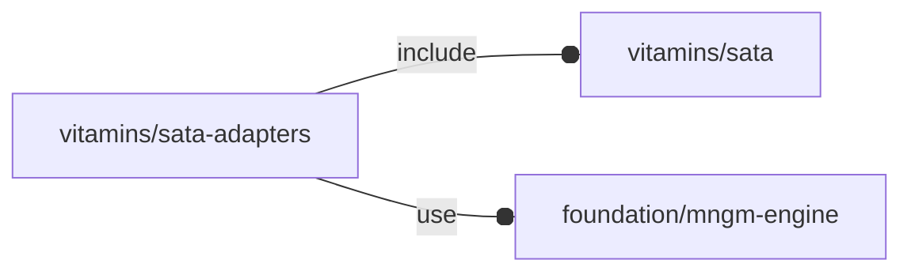

# package vitamins/sata-adapters

## Dependencies

'Naive' SATA adapter definition file.

Copyright © 2021, Giampiero Gabbiani (giampiero@gabbiani.org)

SPDX-License-Identifier: [GPL-3.0-or-later](https://spdx.org/licenses/GPL-3.0-or-later.html)

## Variables

---

### variable FL_SADP_DICT

__Default:__

    [FL_SADP_ELUTENG,]

---

### variable FL_SADP_ELUTENG

__Default:__

    let(socket=FL_SATA_POWERDATASOCKET,handle_size=[47,37,11.6],socket_size=fl_size(socket),size=[handle_size.x,handle_size.y+socket_size.z,handle_size.z],Mpd=fl_T(-fl_Y(FL_NIL))*fl_Ry(180)*fl_Rx(-90)*fl_octant(+Z-Y,type=socket))[fl_name(value="ELUTENG USB 3.0 TO SATA ADAPTER"),fl_bb_corners(value=[[-size.x/2,-handle_size.y,-size.z/2],[size.x/2,socket_size.z,+size.z/2]]),fl_vendor(value=[["Amazon","https://www.amazon.it/gp/product/B007UOXRY0/"]]),["handle size",handle_size],["Mpd",Mpd],["connectors",fl_conn_import(fl_connectors(socket),Mpd)],["SATA socket",socket],]

---

### variable FL_SADP_NS

__Default:__

    "sadp"

## Modules

---

### module sata_adapter

__Syntax:__

    sata_adapter(verbs,type,locators=false,direction,octant)

__Parameters:__

__direction__  
desired direction [director,rotation], native direction when undef ([+X+Y+Z])

__octant__  
when undef native positioning is used

