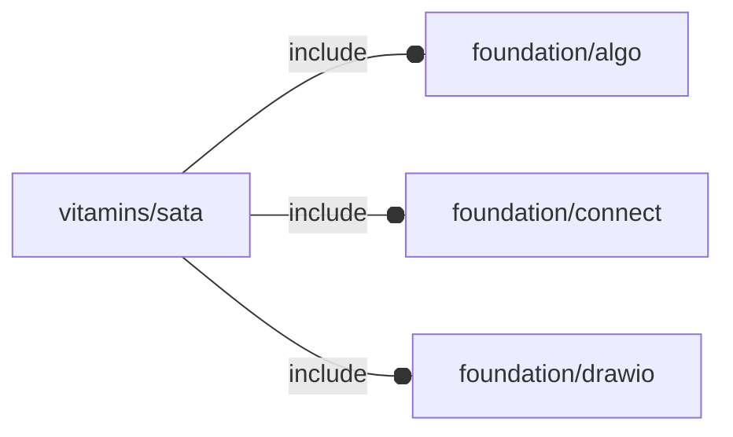

# package vitamins/sata

## Dependencies

## Variables

---

### variable FL_SATA_DATAPLUG

__Default:__

    let(size=[10.41,2.25,5.4],cid=fl_sata_dataCID(),dio_pts=[[0,0],[1,0],[1,1.1/size.y],[1.15/size.x,1.1/size.y],[1.15/size.x,1],[0,1],[0,0]],sz_short=[0.84,size.z-2*0.5,0.1],sz_long=[sz_short.x,size.z-0.5,0.1])[fl_sata_conns(value=[conn_Plug(cid,+FL_X,+FL_Y,[0,0,0.5])]),fl_bb_corners(value=[[0,-size.y,0],[size.x,0,size.z]]),fl_director(value=+FL_Z),fl_rotor(value=+FL_X),fl_sata_type(value="data plug"),["points",dio_polyCoords(dio_pts,size)],["contacts",7],["contact step",1.27],["contact sizes",[["short",sz_short],["long",sz_long],]],["contact pattern",[1,0,0]],]

---

### variable FL_SATA_DICT

__Default:__

    [FL_SATA_POWERPLUG,FL_SATA_DATAPLUG,FL_SATA_POWERDATASOCKET,FL_SATA_POWERDATAPLUG,]

---

### variable FL_SATA_NS

__Default:__

    "sata"

---

### variable FL_SATA_POWERDATAPLUG

__Default:__

    let(power=FL_SATA_POWERPLUG,data=FL_SATA_DATAPLUG,sz_d=fl_size(data),sz_p=fl_size(power),sz_pd=sz_d+fl_X(2.41+sz_p.x),size=[42.2,5.6,sz_pd.z],cid=fl_sata_powerDataCID(),Mshell=fl_T(-fl_Y(.5)),Mpower=Mshell*fl_T(-fl_X(sz_pd.x/2))*fl_T(fl_Y(sz_pd.y/2))*fl_T(-fl_Z(sz_pd.z/2)),Mdata=Mpower*fl_T(fl_X(sz_p.x+2.41)),dc=fl_conn_clone(fl_sata_conn(data),M=Mdata),pc=fl_conn_clone(fl_sata_conn(power),M=Mpower))[fl_sata_conns(value=[pc,dc]),fl_bb_corners(value=[-size/2,+size/2]),fl_director(value=+FL_Z),fl_rotor(value=+FL_X),fl_sata_type(value="power data plug"),["power plug",power],["data plug",data],__fl_sata_Mshell__(value=Mshell),__fl_sata_Mpower__(value=Mpower),__fl_sata_Mdata__(value=Mdata),]

---

### variable FL_SATA_POWERDATASOCKET

__Default:__

    let(side_prism_h=1.5,side_blk_sz=[2,2,4],side_sz=side_blk_sz+[0,0,side_prism_h],blk_sz=[36.5,3.5,5],data_sz=[10.7,2.3,blk_sz.z+2*FL_NIL],power_sz=[20.9,2.3,data_sz.z],Mconn=fl_T(fl_X((data_sz.x-power_sz.x)/2)),size=blk_sz+[2*side_sz.x,0,side_blk_sz.z/8+side_prism_h],cid=fl_sata_powerDataCID(),dio_pts=[[1,0],[1,1],[0,0.5],[0,0]],Mpoly=fl_Ry(90)*fl_T(-fl_X(side_blk_sz.x/2)-fl_Z(side_blk_sz.y/2)),Mprism=fl_Ry(45)*fl_T(fl_Y(side_prism_h/2))*fl_Rx(-90),inter_d=2.41,Mdata=fl_T(fl_X((data_sz.x-power_sz.x)/2))*fl_T([-inter_d/2,data_sz.y/2,-data_sz.z/2]),dc=conn_Socket(fl_sata_dataCID(),-FL_X,+FL_Y,Mdata*[0,0,data_sz.z,1]),Mpower=fl_T(fl_X((data_sz.x-power_sz.x)/2))*fl_T([inter_d/2,power_sz.y/2,-power_sz.z/2]),pc=conn_Socket(fl_sata_powerCID(),-FL_X,+FL_Y,Mpower*[0,0,power_sz.z,1]))[fl_conn_id(value=cid),fl_sata_conns(value=[pc,dc]),fl_bb_corners(value=[-blk_sz/2,+blk_sz/2]),fl_director(value=+FL_Z),fl_rotor(value=+FL_X),fl_sata_type(value="power data socket"),["points",dio_polyCoords(dio_pts,[side_blk_sz.x,side_blk_sz.z,side_blk_sz.y])],["block size",blk_sz],["side block size",side_blk_sz],["prism l1,l2,h",[side_blk_sz.x,0.5,side_prism_h]],["data plug size",data_sz],["power plug size",power_sz],["Mpoly",Mpoly],["Mprism",Mprism],["plug inter distance",inter_d],__fl_sata_Mdata__(value=Mdata),__fl_sata_Mpower__(value=Mpower),]

---

### variable FL_SATA_POWERPLUG

__Default:__

    let(sz_d=fl_size(FL_SATA_DATAPLUG),size=[20.57,sz_d.y,sz_d.z],cid=fl_sata_powerCID(),dio_pts=[[0,0],[1,0],[1,1],[1-1.15/size.x,1],[1-1.15/size.x,1.1/size.y],[0,1.1/size.y],[0,0]],sz_short=[0.84,size.z-2*0.5,0.1],sz_long=[sz_short.x,size.z-0.5,0.1])[fl_sata_conns(value=[conn_Plug(cid,+FL_X,+FL_Y,[size.x,0,0.5])]),fl_bb_corners(value=[[0,-size.y,0],[size.x,0,size.z]]),fl_director(value=+FL_Z),fl_rotor(value=+FL_X),fl_sata_type(value="power plug"),["points",dio_polyCoords(dio_pts,size)],["contacts",15],["contact step",1.27],["contact sizes",[["short",sz_short],["long",sz_long],]],["contact pattern",[0,0,0,1,1,1]],]

## Functions

---

### function fl_sata_conn

__Syntax:__

    fl_sata_conn(type)

---

### function fl_sata_conns

__Syntax:__

    fl_sata_conns(type,value)

---

### function fl_sata_dataCID

__Syntax:__

    fl_sata_dataCID()

---

### function fl_sata_instance

__Syntax:__

    fl_sata_instance(type,value)

---

### function fl_sata_powerCID

__Syntax:__

    fl_sata_powerCID()

---

### function fl_sata_powerDataCID

__Syntax:__

    fl_sata_powerDataCID()

---

### function fl_sata_type

__Syntax:__

    fl_sata_type(type,value)

## Modules

---

### module fl_sata

__Syntax:__

    fl_sata(verbs=FL_ADD,type,connectors=false,direction,octant)

---

### module fl_sata_dataPlug

__Syntax:__

    fl_sata_dataPlug(verbs=FL_ADD,type,connectors=false,direction,octant)

---

### module fl_sata_powerDataPlug

__Syntax:__

    fl_sata_powerDataPlug(verbs=FL_ADD,type,connectors=false,shell=true,direction,octant)

---

### module fl_sata_powerPlug

__Syntax:__

    fl_sata_powerPlug(verbs=FL_ADD,type,connectors=false,direction,octant)

---

### module sata_PowerDataSocket

__Syntax:__

    sata_PowerDataSocket(verbs=FL_ADD,type,connectors=false,direction,octant)

