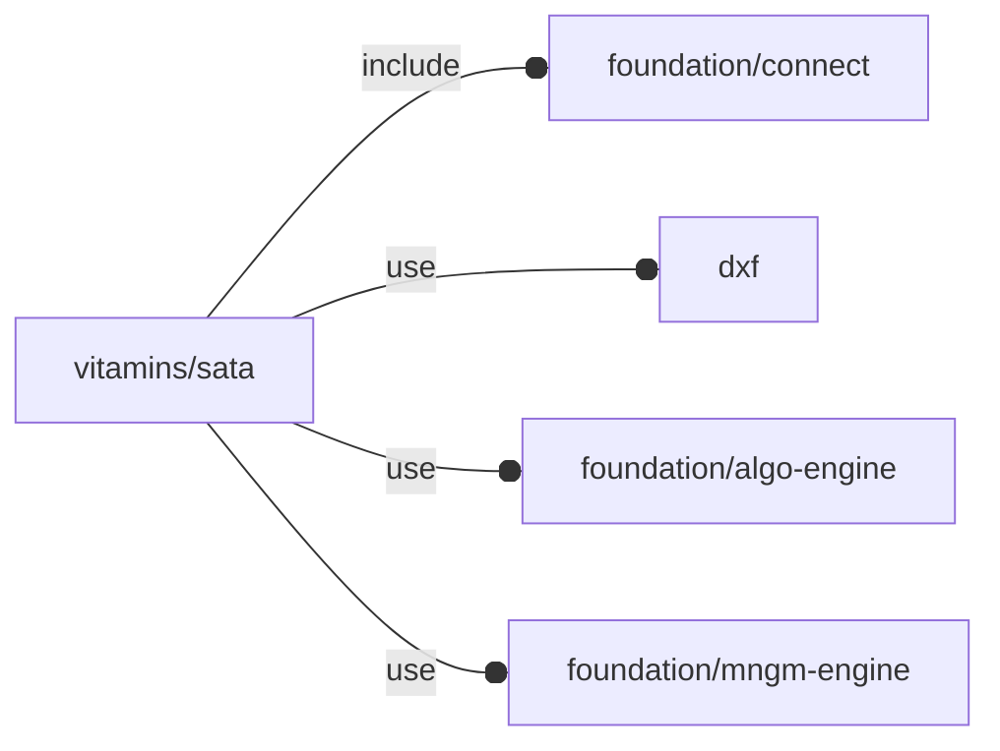

# package vitamins/sata

## Dependencies



'Naive' SATA plug & socket definition.

Copyright © 2021, Giampiero Gabbiani (giampiero@gabbiani.org)

SPDX-License-Identifier: [GPL-3.0-or-later](https://spdx.org/licenses/GPL-3.0-or-later.html)


## Variables

---

### variable FL_SATA_DATAPLUG

__Default:__

    let(dxf="vitamins/sata-data-plug.dxf",w=__dxf_dim__(file=dxf,name="width",layer="sizes"),h=__dxf_dim__(file=dxf,name="height",layer="sizes"),d=__dxf_dim__(file=dxf,name="plug",layer="extrusions"),size=[w,h,d],cid=fl_sata_dataCID(),d_short=__dxf_dim__(file=dxf,name="short",layer="extrusions"),d_long=__dxf_dim__(file=dxf,name="long",layer="extrusions"),c_w=__dxf_dim__(file=dxf,name="c_width",layer="sizes"),c_h=__dxf_dim__(file=dxf,name="c_height",layer="sizes"))fl_Object(bbox=[[0,-size.y,0],[size.x,0,size.z]],engine="sata/single plug",others=[fl_dxf(value=dxf),fl_connectors(value=[conn_Plug(cid,+X,+Y,[0,0,0])]),fl_cutout(value=[+Z]),["contact sizes",[["short",[c_w,c_h,d_short]],["long",[c_w,c_h,d_long]]]]])

---

### variable FL_SATA_DICT

__Default:__

    [FL_SATA_POWERPLUG,FL_SATA_DATAPLUG,FL_SATA_POWERDATASOCKET,FL_SATA_POWERDATAPLUG,]

---

### variable FL_SATA_NS

__Default:__

    "sata"

---

### variable FL_SATA_POWERDATAPLUG

__Default:__

    let(power=FL_SATA_POWERPLUG,data=FL_SATA_DATAPLUG,dxf="vitamins/sata-powerdata-plug.dxf",w=__dxf_dim__(file=dxf,name="width",layer="sizes"),h=__dxf_dim__(file=dxf,name="height",layer="sizes"),d=__dxf_dim__(file=dxf,name="plug",layer="extrusions"),thick=__dxf_dim__(file=dxf,name="shell thick",layer="extrusions"),size=[w,h,d+thick],sz_d=fl_size(data),sz_p=fl_size(power),cid=fl_sata_powerDataCID(),Mpower=let(p2d=version_num()>20210507?__dxf_cross__(file=dxf,layer="power translation"):[-16.6953,1.15039])T([p2d.x,p2d.y,thick]),Mdata=let(p2d=version_num()>20210507?__dxf_cross__(file=dxf,layer="data translation"):[6.28516,1.15039])T([p2d.x,p2d.y,thick]),dc=fl_conn_clone(fl_connectors(data)[0],M=Mdata*T(-Z(size.z/2))),pc=fl_conn_clone(fl_connectors(power)[0],M=Mpower*T(-Z(size.z/2))))fl_Object(bbox=[-size/2,+size/2],engine="sata/composite plug",others=[fl_dxf(value=dxf),fl_connectors(value=[pc,dc]),fl_cutout(value=[+Z]),["power plug",power],["data plug",data],["shell thick",thick],__fl_sata_Mpower__(value=Mpower),__fl_sata_Mdata__(value=Mdata),])

---

### variable FL_SATA_POWERDATASOCKET

__Default:__

    let(side_prism_h=1.5,side_blk_sz=[2,2,4],side_sz=side_blk_sz+[0,0,side_prism_h],blk_sz=[36.5,3.5,5],data_sz=[10.7,2.3,blk_sz.z+2*FL_NIL],power_sz=[20.9,2.3,data_sz.z],Mconn=fl_T(fl_X((data_sz.x-power_sz.x)/2)),size=blk_sz+[2*side_sz.x,0,side_blk_sz.z/8+side_prism_h],cid=fl_sata_powerDataCID(),Mpoly=fl_Ry(90)*fl_T(-fl_X(side_blk_sz.x/2)-fl_Z(side_blk_sz.y/2)),Mprism=fl_Ry(45)*fl_T(fl_Y(side_prism_h/2))*fl_Rx(-90),inter_d=2.41,Mdata=fl_T(fl_X((data_sz.x-power_sz.x)/2))*fl_T([-inter_d/2,data_sz.y/2,-data_sz.z/2]),dc=conn_Socket(fl_sata_dataCID(),-FL_X,+FL_Y,Mdata*[0,0,data_sz.z,1]),Mpower=fl_T(fl_X((data_sz.x-power_sz.x)/2))*fl_T([inter_d/2,power_sz.y/2,-power_sz.z/2]),pc=conn_Socket(fl_sata_powerCID(),-FL_X,+FL_Y,Mpower*[0,0,power_sz.z,1]))fl_Object(bbox=[-blk_sz/2,+blk_sz/2],engine="sata/composite socket",others=[fl_conn_id(value=cid),fl_connectors(value=[pc,dc]),fl_cutout(value=[+Z]),["points",[[2,0],[2,-4],[0,-2],[0,0]]],["block size",blk_sz],["side block size",side_blk_sz],["prism l1,l2,h",[side_blk_sz.x,0.5,side_prism_h]],["data plug size",data_sz],["power plug size",power_sz],["Mpoly",Mpoly],["Mprism",Mprism],["plug inter distance",inter_d],__fl_sata_Mdata__(value=Mdata),__fl_sata_Mpower__(value=Mpower),])

---

### variable FL_SATA_POWERPLUG

__Default:__

    let(dxf="vitamins/sata-power-plug.dxf",w=__dxf_dim__(file=dxf,name="width",layer="sizes"),h=__dxf_dim__(file=dxf,name="height",layer="sizes"),d=__dxf_dim__(file=dxf,name="plug",layer="extrusions"),size=[w,h,d],cid=fl_sata_powerCID(),d_short=__dxf_dim__(file=dxf,name="short",layer="extrusions"),d_long=__dxf_dim__(file=dxf,name="long",layer="extrusions"),c_w=__dxf_dim__(file=dxf,name="c_width",layer="sizes"),c_h=__dxf_dim__(file=dxf,name="c_height",layer="sizes"))fl_Object(bbox=[[0,-size.y,0],[size.x,0,size.z]],engine="sata/single plug",others=[fl_dxf(value=dxf),fl_connectors(value=[conn_Plug(cid,+X,+Y,[size.x,0,0])]),fl_cutout(value=[+Z]),["contact sizes",[["short",[c_w,c_h,d_short]],["long",[c_w,c_h,d_long]]]]])

## Functions

---

### function fl_sata_dataCID

__Syntax:__

```text
fl_sata_dataCID()
```

---

### function fl_sata_plug

__Syntax:__

```text
fl_sata_plug(type,value)
```

---

### function fl_sata_powerCID

__Syntax:__

```text
fl_sata_powerCID()
```

---

### function fl_sata_powerDataCID

__Syntax:__

```text
fl_sata_powerDataCID()
```

---

### function fl_sata_sock

__Syntax:__

```text
fl_sata_sock(type,value)
```

## Modules

---

### module fl_sata

__Syntax:__

    fl_sata(verbs=FL_ADD,type,drift=0,cut_dirs,octant,direction)

SATA plug and socket module.

Context variables:

| Name           | Context   | Description                           |
| ------------   | -----     | ------------------------------------- |
| $dbg_Symbols   | Execution | when true connector symbols are shown |
| $fl_thickness  | Parameter | Used during FL_CUTOUT                 |
| $fl_tolerance  | Parameter | Used during FL_CUTOUT                 |


__Parameters:__

__verbs__  
supported verbs: FL_ADD, FL_AXES, FL_BBOX, FL_CUTOUT, FL_FOOTPRINT

__drift__  
FL_CUTOUT scalar drift

__cut_dirs__  
Cutout direction list in floating semi-axis list (see also
[fl_tt_isAxisList()](../foundation/traits-engine.md#function-fl_tt_isaxislist)).

**NOTE**: defaults to [fl_cutout()](../foundation/core.md#function-fl_cutout) when undef (so all the preferred cutout
directions are included)

Example 1:

    cut_dirs=[+X,+Z]

in this case the ethernet plug will perform a cutout along +X (since +Z is
not supported).

Example 2:

    cut_dirs=undef

in this case the ethernet plug will perform a cutout along +X (the
supported cutout direction).

Example 3:

    cut_dirs=[]

in this case the ethernet plug will not perform any cutout.


__octant__  
when undef native positioning is used

__direction__  
desired direction [director,rotation], native direction when undef ([+X+Y+Z])


