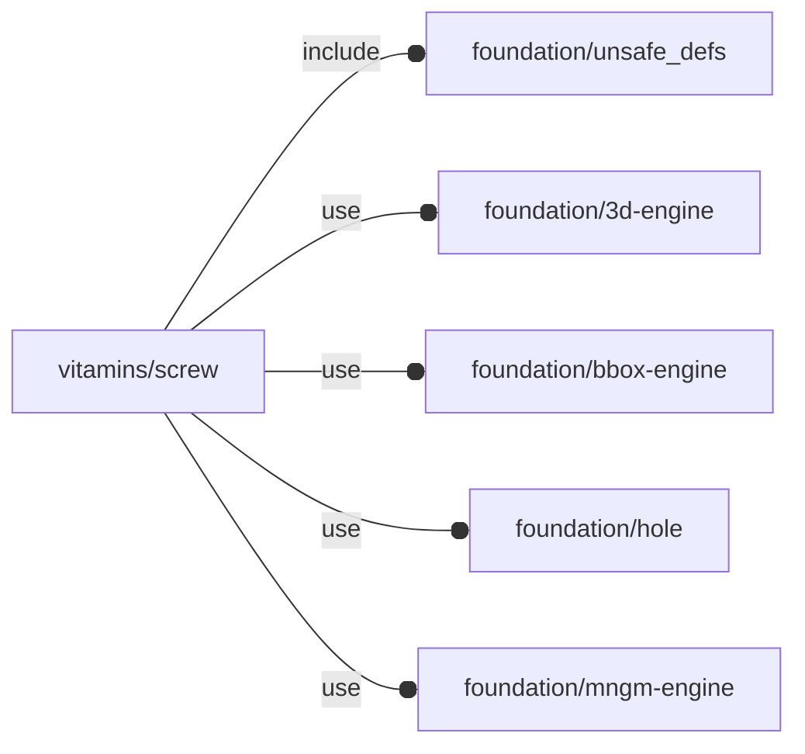

# package vitamins/screw

## Dependencies



Screw implementation file for OpenSCAD Foundation Library.

Copyright © 2021, Giampiero Gabbiani (giampiero@gabbiani.org)

SPDX-License-Identifier: [GPL-3.0-or-later](https://spdx.org/licenses/GPL-3.0-or-later.html)


## Variables

---

### variable FL_SCREW_DICT

__Default:__

    [No632_pan_screw,M2_cap_screw,M2_cs_cap_screw,M2_dome_screw,M2p5_cap_screw,M2p5_dome_screw,M2p5_pan_screw,M3_cap_screw,M3_cs_cap_screw,M3_dome_screw,M3_grub_screw,M3_hex_screw,M3_low_cap_screw,M3_pan_screw,M3_shoulder_screw,M4_cap_screw,M4_cs_cap_screw,M4_dome_screw,M4_grub_screw,M4_hex_screw,M4_pan_screw,M4_shoulder_screw,M5_cap_screw,M5_cs_cap_screw,M5_dome_screw,M5_grub_screw,M5_hex_screw,M5_pan_screw,M6_cap_screw,M6_cs_cap_screw,M6_grub_screw,M6_hex_screw,M6_pan_screw,M8_cap_screw,M8_cs_cap_screw,M8_hex_screw,No2_screw,No4_screw,No6_cs_screw,No6_screw,No8_screw]

screw dictionary

---

### variable FL_SCREW_NS

__Default:__

    "screw"

screw namespace

## Functions

---

### function fl_bb_screw

__Syntax:__

```text
fl_bb_screw(type,length)
```

bounding box

---

### function fl_screw_byNominal

__Syntax:__

```text
fl_screw_byNominal(diameter)
```

return a filter by screw nominal «diameter»

This can be used by function [fl_list_filter()](../foundation/core.md#function-fl_list_filter).


---

### function fl_screw_l

__Syntax:__

```text
fl_screw_l(type,len,washer="no",nut="no",xwasher="no",nwasher=false)
```

Returns the overall length of a screw (according to parameters).

Context parameters: see [fl_screw{}](#module-fl_screw).


__Parameters:__

__washer__  
screw washer : "no","default","penny","nylon"

__nut__  
screw nut    : "no","default","nyloc"

__xwasher__  
extra washer : "no","spring","star"

__nwasher__  
nut washer


---

### function fl_screw_lens

__Syntax:__

```text
fl_screw_lens(type,len,washer="no",nut="no",xwasher="no",nwasher=false)
```

return a list with layered thickness (according to parameters):

0. overall screw length
1. passed thickness
2. washer thickness
3. extra washer (spring or star) thickness
4. nut washer thickness
5. nut thickness

:memo: **Note:** if one layer is "off", the corresponding thickness will be 0

Context parameters: see [fl_screw{}](#module-fl_screw).


__Parameters:__

__washer__  
screw washer : "no","default","penny","nylon"

__nut__  
screw nut    : "no","default","nyloc"

__xwasher__  
extra washer : "no","spring","star"

__nwasher__  
nut washer


---

### function fl_screw_nominal

__Syntax:__

```text
fl_screw_nominal(nop)
```

screw nominal diameter

---

### function fl_screw_search

__Syntax:__

```text
fl_screw_search(dictionary=FL_SCREW_DICT,d,head_type,nut,washer)
```

Return a list of screws from dictionary, matching the passed properties.

__NOTE__: when a parameter is undef the corresponding property is not checked.


__Parameters:__

__dictionary__  
search dictionary

__d__  
nominal diameter

__head_type__  
screw type is one of the following:
 - hs_cap
 - hs_pan
 - hs_cs
 - hs_hex
 - hs_grub
 - hs_cs_cap
 - hs_dome


__nut__  
bool, when true is required, when false or undef is ignored

__washer__  
"no", "default", "penny", "nylon". when "no" or undef is ignored


---

### function fl_screw_size

__Syntax:__

```text
fl_screw_size(type,length)
```

return the [x,y,z] size of the screw

## Modules

---

### module fl_screw

__Syntax:__

    fl_screw(verbs=FL_ADD,type,len,washer="no",nut="no",xwasher="no",nwasher=false,dri_type="clearance",direction,octant)

Context parameters:

| name           | Description   |
| -------------- | ------------  |
| $fl_thickness  |  material thickness to be drilled, see also [fl_parm_thickness()](../foundation/core.md#function-fl_parm_thickness) |


__Parameters:__

__verbs__  
supported verbs: FL_ADD, FL_ASSEMBLY, FL_BBOX, FL_DRILL, FL_FOOTPRINT, FL_LAYOUT

__type__  
NopSCADlib screw type

__len__  
when passed a fixed len will be used instead of [fl_screw_l()](#function-fl_screw_l)

__washer__  
screw washer : "no","default","penny","nylon"

__nut__  
screw nut    : "no","default","nyloc"

__xwasher__  
extra washer : "no","spring","star"

__nwasher__  
nut washer

__dri_type__  
drill type: "clearance" or "tap"

__direction__  
desired direction [director,rotation], native direction when undef ([+X+Y+Z])

__octant__  
when undef native positioning is used


---

### module fl_screw_holes

__Syntax:__

    fl_screw_holes(holes,enable=[-X,+X,-Y,+Y,-Z,+Z],depth=0,screw,type="clearance",tolerance=0,countersunk=false)

Screw driven hole execution. The main difference between this module and
[fl_lay_holes{}](../foundation/hole.md#module-fl_lay_holes) is that the FL_DRILL verb is delegated to screws.

See [fl_hole_Context{}](../foundation/hole.md#module-fl_hole_context) for context variables passed to children().

Runtime environment:

- $fl_thickness: added to the hole depth

:memo: **NOTE:** supported normals are x,y or z semi-axis ONLY


__Parameters:__

__holes__  
list of hole specs

__enable__  
enabled normals in floating semi-axis list form

__depth__  
pass-through hole depth

__screw__  
fallback screw

__type__  
drill type ("clearance" or "tap")

__tolerance__  
tolerance ⌀


