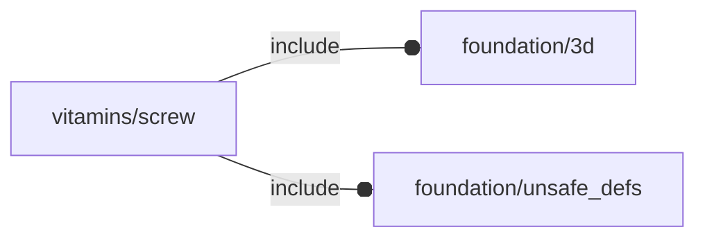

# package vitamins/screw

## Dependencies



## Functions

---

### function fl_bb_screw

__Syntax:__

```text
fl_bb_screw(type,length)
```

---

### function fl_screw_l

__Syntax:__

```text
fl_screw_l(type,len,thick=0,washer="no",nut="no",xwasher="no",nwasher=false)
```

---

### function fl_screw_lens

__Syntax:__

```text
fl_screw_lens(type,len,thick=0,washer="no",nut="no",xwasher="no",nwasher=false)
```

---

### function fl_screw_size

__Syntax:__

```text
fl_screw_size(type,length)
```

## Modules


---

### module fl_screw

__Syntax:__

    fl_screw(verbs=FL_ADD,type,len,thick=0,washer="no",nut="no",xwasher="no",nwasher=false,direction,octant)

