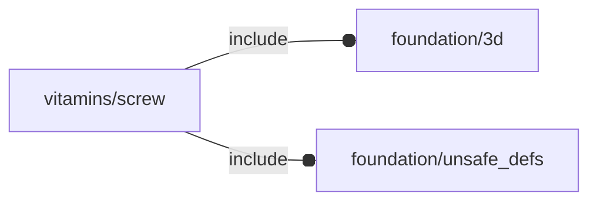

# package vitamins/screw

## Dependencies



Screw implementation file for OpenSCAD Foundation Library.

Copyright © 2021, Giampiero Gabbiani (giampiero@gabbiani.org)

SPDX-License-Identifier: [GPL-3.0-or-later](https://spdx.org/licenses/GPL-3.0-or-later.html)


## Functions

---

### function fl_bb_screw

__Syntax:__

```text
fl_bb_screw(type,length)
```

bounding box

---

### function fl_screw_l

__Syntax:__

```text
fl_screw_l(type,len,thick=0,washer="no",nut="no",xwasher="no",nwasher=false)
```

return the overall length of a screw (according to parameters)

__Parameters:__

__washer__  
screw washer : "no","default","penny","nylon"

__nut__  
screw nut    : "no","default","nyloc"

__xwasher__  
extra washer : "no","spring","star"

__nwasher__  
nut washer


---

### function fl_screw_lens

__Syntax:__

```text
fl_screw_lens(type,len,thick=0,washer="no",nut="no",xwasher="no",nwasher=false)
```

return a list with layered thickness (according to parameters):

0. overall screw length
1. passed thickness
2. washer thickness
3. extra washer (spring or star) thickness
4. nut washer thickness
5. nut thickness

:memo: **Note:** if one layer is "off", the corresponding thickness will be 0


__Parameters:__

__washer__  
screw washer : "no","default","penny","nylon"

__nut__  
screw nut    : "no","default","nyloc"

__xwasher__  
extra washer : "no","spring","star"

__nwasher__  
nut washer


---

### function fl_screw_size

__Syntax:__

```text
fl_screw_size(type,length)
```

return the [x,y,z] size of the screw

## Modules

---

### module fl_screw

__Syntax:__

    fl_screw(verbs=FL_ADD,type,len,thick=0,washer="no",nut="no",xwasher="no",nwasher=false,direction,octant)

__Parameters:__

__verbs__  
supported verbs: FL_ADD, FL_ASSEMBLY, FL_BBOX, FL_DRILL, FL_FOOTPRINT, FL_LAYOUT

__type__  
NopSCADlib screw type

__len__  
when passed a fixed len will be used instead of [fl_screw_l()](#function-fl_screw_l)

__thick__  
thickness part passed to [fl_screw_l()](#function-fl_screw_l) during length calculation

__washer__  
screw washer : "no","default","penny","nylon"

__nut__  
screw nut    : "no","default","nyloc"

__xwasher__  
extra washer : "no","spring","star"

__nwasher__  
nut washer

__direction__  
desired direction [director,rotation], native direction when undef ([+X+Y+Z])

__octant__  
when undef native positioning is used


