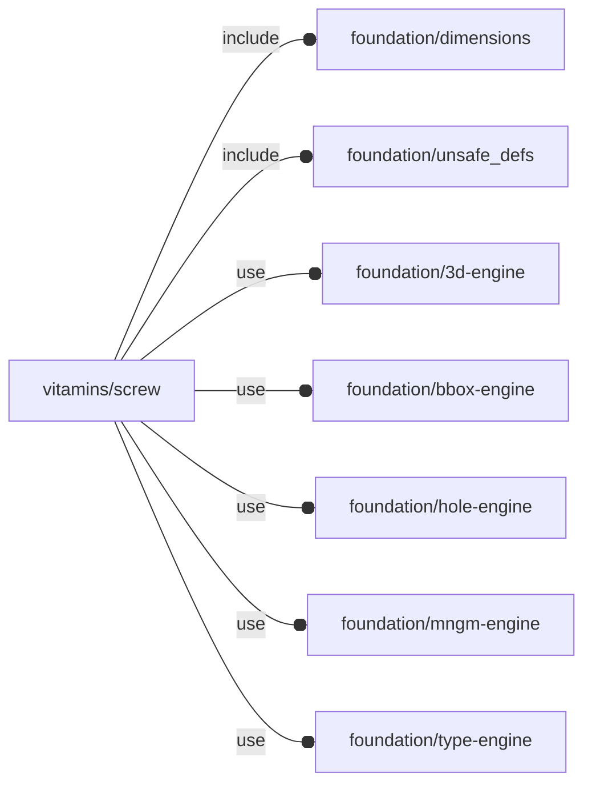

# package vitamins/screw

## Dependencies



Screw implementation file for OpenSCAD Foundation Library.

Copyright © 2021, Giampiero Gabbiani (giampiero@gabbiani.org)

SPDX-License-Identifier: [GPL-3.0-or-later](https://spdx.org/licenses/GPL-3.0-or-later.html)


## Variables

---

### variable FL_SCREW_NS

__Default:__

    "screw"

screw namespace

---

### variable FL_SCREW_SPECS_INVENTORY

__Default:__

    [for(list=screw_lists,screw=list)if(screw)screw]

Screw **specifications** inventory in NopSCADlib format.


## Functions

---

### function fl_Screw

__Syntax:__

```text
fl_Screw(nop,length,longer_than,shorter_than,head_spring,head_washer,thickness,nut_washer,nut_spring,nut)
```

Screw constructor: build a screw object from specifications and length.


__Parameters:__

__nop__  
NopSCADlib screw specifications

__length__  
Shaft length

__longer_than__  
Shaft length longer or equal than «longer_then»

__shorter_than__  
Shaft length shorter or equal than «shorter_then»

__head_spring__  
undef, "spring" or "star"

__head_washer__  
undef, "default" or "penny"

__thickness__  
material thickness

__nut_washer__  
undef, "default" or "penny"

__nut_spring__  
undef, "spring" or "star"

__nut__  
undef, "default" or "nyloc"


---

### function fl_ScrewInventory

__Syntax:__

```text
fl_ScrewInventory(specs=FL_SCREW_SPECS_INVENTORY,name,nominal,head_type,head_name,length,longer_than,shorter_than,head_spring,head_washer,thickness,nut_washer,nut_spring,nut)
```

Builds a screw object inventory from specifications selection and shaft length.


__Parameters:__

__specs__  
mandatory search inventory

__name__  
screw name, ignored when undef

__nominal__  
nominal ⌀, when 0 or undef is ignored

__head_type__  
Either a scalar or a list with each element equal to one of the following:

 - hs_cap
 - hs_pan
 - hs_cs
 - hs_hex
 - hs_grub
 - hs_cs_cap
 - hs_dome


__head_name__  
head name is one of the following:

 - "cap"
 - "pan"
 - "cs"
 - "hex"
 - "grub"
 - "cs_cap"
 - "dome"


__length__  
Shaft exact length

__longer_than__  
Shaft length longer or equal to «longer_then»

__shorter_than__  
Shaft length shorter or equal to «shorter_then»

__head_spring__  
undef, "spring" or "star"

__head_washer__  
undef, "default" or "penny"

__thickness__  
material thickness

__nut_washer__  
undef, "default" or "penny"

__nut_spring__  
undef, "spring" or "star"

__nut__  
undef, "default" or "nyloc"


---

### function fl_screw_AssemblyStack

__Syntax:__

```text
fl_screw_AssemblyStack(type,shaft,head_spring,head_washer,thickness,nut_washer,nut_spring,nut)
```

Screw assembly stack.

The screw assembly stack is a stack of accessory elements mounted on a screw
when finally assembled. This type represents a 'generic' not exhaustive
logic considering the following elements in a top-down order:

- screw head
- optional head spring or star washer
- optional head washer
- optional material thickness
- optional nut washer
- optional nut spring or star washer
- optional nut

The returned list includes all the thicknesses that contribute to determining
the minimum necessary screw shank length:

0. exact length of the shank resulting from the sum of the thicknesses of
   each element of the stack
1. nearest standard screw length ≥ to the previous one
2. head spring or star washer thickness (0 if not present)
3. head washer thickness (0 if not present)
4. material thickness as passed to the function (0 if not present)
5. optional nut washer thickness (0 if not present)
6. optional nut spring or star washer thickness (0 if not present)
7. optional nut thickness (0 if not present)

The assembly stack can be built in two ways:

- without a prefixed length («shank» parameter set to 0 or undef)
- with a prefixed shank («shank» parameter ≠ 0)


__Parameters:__

__type__  
NopSCADlib screw type

__shaft__  
screw length, when undef or 0 the length is calculated

__head_spring__  
undef, "spring" or "star"

__head_washer__  
undef, "default" or "penny"

__thickness__  
material thickness

__nut_washer__  
undef, "default" or "penny"

__nut_spring__  
undef, "spring" or "star"

__nut__  
undef, "default" or "nyloc"


---

### function fl_screw_clearanceD

__Syntax:__

```text
fl_screw_clearanceD(type)
```

Returns the hole ⌀ used during "clearance" FL_DRILL according to the
following formula:

    hole ⌀ = nominal ⌀ + 2 * $fl_clearance

The nominal ⌀ is the screw shaft ⌀ (i.e. the diameter of the screw without
the head).

The $fl_clearance parameter is used to add a clearance to the hole ⌀. This
is useful when the screw is not a perfect fit in the hole.

:memo: **NOTE:** when $fl_clearance is undef, the NopSCADlib clearance is used for
the hole ⌀ calculation.

Context variables:

| name           | Context   | Description
| ---            | ---       | ---
| $fl_clearance  | Parameter | See also [fl_parm_clearance()](../foundation/core.md#function-fl_parm_clearance).


---

### function fl_screw_headD

__Syntax:__

```text
fl_screw_headD(type)
```

Returns the head ⌀

---

### function fl_screw_headDepth

__Syntax:__

```text
fl_screw_headDepth(type,d=0)
```

How far a counter sink head will go into a straight hole ⌀ «d»

---

### function fl_screw_headH

__Syntax:__

```text
fl_screw_headH(type)
```

Returns the head height

---

### function fl_screw_headType

__Syntax:__

```text
fl_screw_headType(type)
```

Returns the head style (hs_cap, hs_pan, hs_cs, hs_hex, hs_grub, hs_cs_cap or hs_dome)

---

### function fl_screw_nut

__Syntax:__

```text
fl_screw_nut(type)
```

Returns the default nut

---

### function fl_screw_shaft

__Syntax:__

```text
fl_screw_shaft(type,value)
```

Screw shaft length (i.e. the length of the screw without the head)

---

### function fl_screw_specs

__Syntax:__

```text
fl_screw_specs(type,value,default)
```

screw specifications in NopSCADlib format

---

### function fl_screw_specs_select

__Syntax:__

```text
fl_screw_specs_select(inventory=FL_SCREW_SPECS_INVENTORY,name,nominal,head_type,head_name,nut,washer)
```

Return a list of screw **specifications** matching the passed properties from
«inventory».

:memo: **NOTE:** when a parameter is undef the corresponding property is not
checked.


__Parameters:__

__inventory__  
mandatory search inventory

__name__  
screw name, ignored when undef

__nominal__  
nominal ⌀, when 0 or undef is ignored

__head_type__  
Either a scalar or a list with each element equal to one of the following:

 - hs_cap
 - hs_pan
 - hs_cs
 - hs_hex
 - hs_grub
 - hs_cs_cap
 - hs_dome


__head_name__  
head name is one of the following:

 - "cap"
 - "pan"
 - "cs"
 - "hex"
 - "grub"
 - "cs_cap"
 - "dome"


__nut__  
nut support:

- undef    : no nut required
- "default": default nut required
- "nyloc"  : nyloc nut required


__washer__  
washer support, is either a scalar or a list with each element equal to one of:

- "default": default washer required
- "penny"  : penny washer required
- "spring" : spring washer required
- "star"   : star washer required

:memo: **NOTE:** if undef or [] no washer support required


---

### function fl_screw_threadD

__Syntax:__

```text
fl_screw_threadD(type)
```

Screw thread ⌀

---

### function fl_screw_threadMax

__Syntax:__

```text
fl_screw_threadMax(type)
```

Max screw thread length

## Modules

---

### module fl_screw

__Syntax:__

    fl_screw(verbs=FL_ADD,type,head_spring,head_washer,nut_washer,nut_spring,nut,dri_type="clearance",direction,octant)

Context variables:

| name           | Context   | Description
| ---            | ---       | ---
| $fl_clearance  | Parameter | used during FL_DRILL. See also [fl_parm_clearance()](../foundation/core.md#function-fl_parm_clearance)
| $fl_thickness  | Parameter | thickness during FL_ASSEMBLY. See also [fl_parm_thickness()](../foundation/core.md#function-fl_parm_thickness)
| $fl_tolerance  | Parameter | used during FL_FOOTPRINT. See also fl_parm_tolerance()


__Parameters:__

__verbs__  
supported verbs: FL_ADD, FL_ASSEMBLY, FL_BBOX, FL_DRILL, FL_FOOTPRINT, FL_LAYOUT

__type__  
NopSCADlib screw type

__head_spring__  
undef, "spring" or "star"

__head_washer__  
undef, "default", "penny" or "nylon"

__nut_washer__  
undef, "default", "penny" or "nylon"

__nut_spring__  
undef, "spring" or "star"

__nut__  
undef, "default" or "nyloc"

__dri_type__  
drill type: "clearance" or "tap"

__direction__  
desired direction [director,rotation], native direction when undef ([+X+Y+Z])

__octant__  
when undef native positioning is used


---

### module fl_screw_holes

__Syntax:__

    fl_screw_holes(holes,enable=[-X,+X,-Y,+Y,-Z,+Z],depth=0,nop_screw,type="clearance",tolerance=0,countersunk=false)

Screw driven hole execution. The main difference between this module and
[fl_lay_holes{}](../foundation/hole-engine.md#module-fl_lay_holes) is that the FL_DRILL verb is delegated to screws.

See [fl_hole_Context{}](../foundation/hole-engine.md#module-fl_hole_context) for context variables passed to children().

Runtime environment:

- $fl_thickness: added to the hole depth

:memo: **NOTE:** supported normals are x,y or z semi-axis ONLY


__Parameters:__

__holes__  
list of hole specs

__enable__  
enabled normals in floating semi-axis list form

__depth__  
pass-through hole depth

__nop_screw__  
fallback NopSCADlib screw specs

__type__  
drill type ("clearance" or "tap")


