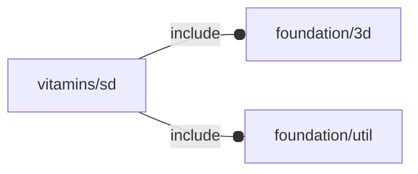

# package vitamins/sd

## Dependencies

Secure Digital flash memory card for OpenSCAD Foundation Library.

*Published under __GNU General Public License v3__*

## Variables

---

### variable FL_SD_DICT

__Default:__

    []

sd dictionary

---

### variable FL_SD_MOLEX_uSD_SOCKET

__Default:__

    let(size=[12,11.5,1.28])[fl_bb_corners(value=[[-size.x/2,-size.y/2,0],[+size.x/2,+size.y/2,+size.z]]),fl_director(value=-Y),fl_rotor(value=+X),]

---

### variable FL_SD_NS

__Default:__

    "sd"

sd namespace

## Modules

---

### module fl_sd_usocket

__Syntax:__

    fl_sd_usocket(verbs=FL_ADD,type,cut_thick,cut_tolerance=0,direction,octant)

micro SD socket

__Parameters:__

__verbs__  
supported verbs: FL_ADD, FL_BBOX, FL_CUTOUT

__type__  
Secure Digital flash memory card socket type

__cut_thick__  
thickness for FL_CUTOUT

__cut_tolerance__  
tolerance used during FL_CUTOUT

__direction__  
desired direction [director,rotation], native direction when undef ([+X+Y+Z])

__octant__  
when undef native positioning is used

