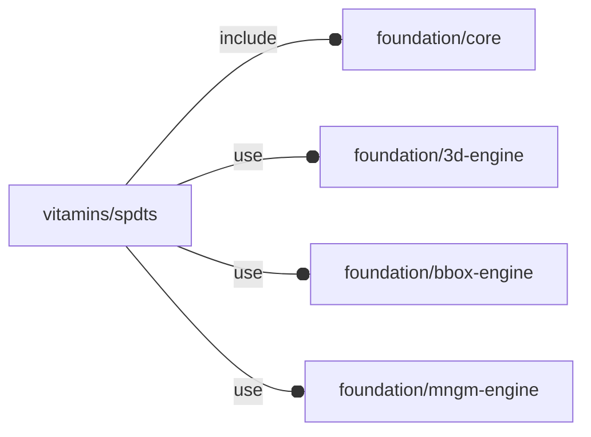

# package vitamins/spdts

## Dependencies



Single pole, double throw switch.

Copyright © 2021, Giampiero Gabbiani (giampiero@gabbiani.org)

SPDX-License-Identifier: [GPL-3.0-or-later](https://spdx.org/licenses/GPL-3.0-or-later.html)


## Variables

---

### variable FL_SODAL_SPDT

__Default:__

    let(len=40,d=19,head_d=22,head_h=+2)[fl_name(value="B077HJT92M"),fl_description(value="SODIAL(R) SPDT Button Switch 220V"),fl_bb_corners(value=[[-head_d/2,-head_d/2,-len+head_h],[+head_d/2,+head_d/2,head_h],]),["nominal diameter",d],["length",len],["head diameter",head_d],["head height",head_h],fl_vendor(value=[["Amazon","https://www.amazon.it/gp/product/B077HJT92M/"],]),]

---

### variable FL_SPDT_DICT

__Default:__

    [FL_SODAL_SPDT]

## Functions

---

### function fl_spdt_d

__Syntax:__

```text
fl_spdt_d(type)
```

---

### function fl_spdt_headD

__Syntax:__

```text
fl_spdt_headD(type)
```

---

### function fl_spdt_headH

__Syntax:__

```text
fl_spdt_headH(type)
```

---

### function fl_spdt_l

__Syntax:__

```text
fl_spdt_l(type)
```

## Modules

---

### module fl_spdt

__Syntax:__

    fl_spdt(verbs=FL_ADD,type,direction,octant,debug)

__Parameters:__

__verbs__  
supported verbs: FL_ADD, FL_BBOX, FL_DRILL

__type__  
prototype

__direction__  
desired direction [director,rotation], native direction when undef ([+Z,0])

__octant__  
when undef native positioning is used

__debug__  
see constructor [fl_parm_Debug()](../foundation/core.md#function-fl_parm_debug)


