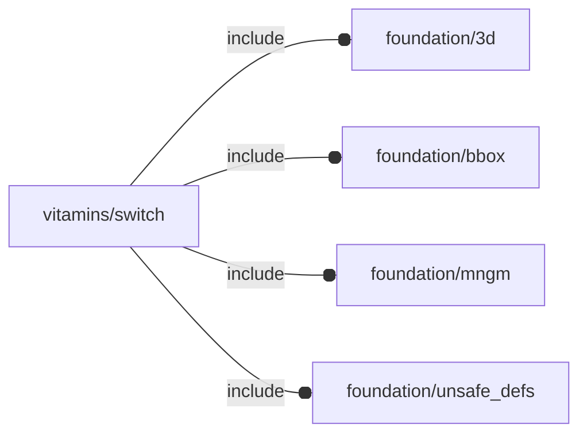

# package vitamins/switch

## Dependencies

## Variables

---

### variable FL_SWT_DICT

__Default:__

    [FL_SWT_USWITCH_7p2x3p4x3x2p5]

---

### variable FL_SWT_NS

__Default:__

    "swt"

template namespace

---

### variable FL_SWT_USWITCH_7p2x3p4x3x2p5

__Default:__

    let(Tbutton=1,Tshild=0.1,w=7,h=3.4,l=2.5+Tbutton)[fl_bb_corners(value=[[-l+Tbutton,-w/2,0],[Tbutton,+w/2,h]]),fl_director(value=+X),fl_rotor(value=+Y),]

## Modules

---

### module fl_switch

__Syntax:__

    fl_switch(verbs=FL_ADD,type,cut_thick,cut_tolerance,cut_drift,direction,octant)

__Parameters:__

__verbs__  
supported verbs: FL_ADD, FL_ASSEMBLY, FL_BBOX, FL_DRILL, FL_FOOTPRINT, FL_LAYOUT

__direction__  
desired direction [director,rotation], native direction when undef ([+X+Y+Z])

__octant__  
when undef native positioning is used

