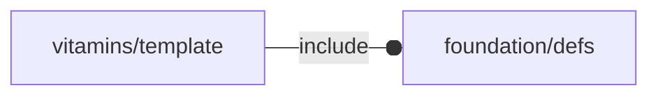

# package vitamins/template

## Dependencies

## Variables

---

### variable FL_TEMP_DICT

__Default:__

    []

---

### variable FL_TEMP_NS

__Default:__

    "mag"

## Modules

---

### module stub

__Syntax:__

    stub(verbs=FL_ADD,type,direction,octant)

