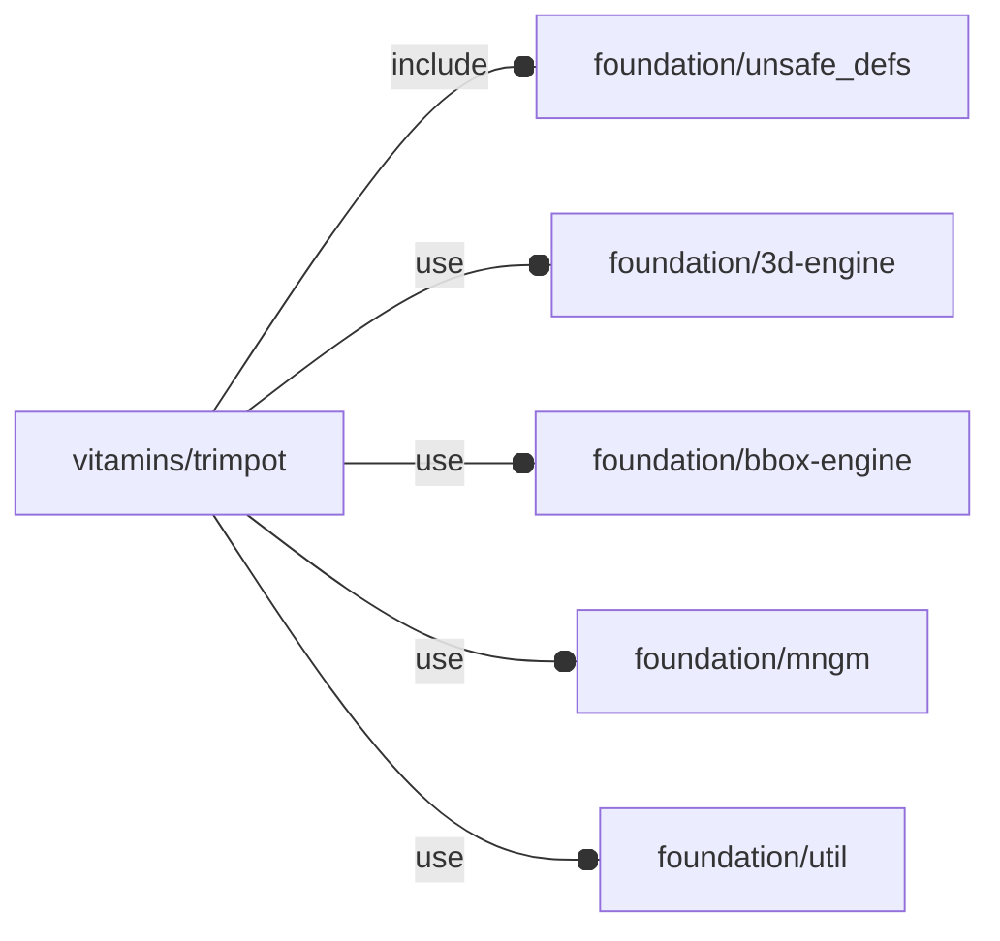

# package vitamins/trimpot

## Dependencies

trimpot engine file

Copyright © 2021, Giampiero Gabbiani (giampiero@gabbiani.org)

SPDX-License-Identifier: [GPL-3.0-or-later](https://spdx.org/licenses/GPL-3.0-or-later.html)

## Variables

---

### variable FL_TRIM_NS

__Default:__

    "trim"

---

### variable FL_TRIM_POT10

__Default:__

    let(sz=[9.5,10+1.5,4.8])[fl_name(value="ten turn trimpot"),fl_bb_corners(value=[[-sz.x/2,-sz.y/2-1.5/2,0],[sz.x/2,sz.y/2-1.5/2,sz.z]]),]

## Modules

---

### module fl_trimpot

__Syntax:__

    fl_trimpot(verbs=FL_ADD,type,cut_thick,cut_tolerance=0,cut_drift=0,direction,octant)

__Parameters:__

__verbs__  
supported verbs: FL_ADD, FL_ASSEMBLY, FL_BBOX, FL_DRILL, FL_FOOTPRINT, FL_LAYOUT

__cut_thick__  
thickness for FL_CUTOUT

__cut_tolerance__  
tolerance used during FL_CUTOUT

__cut_drift__  
translation applied to cutout (default 0)

__direction__  
desired direction [director,rotation], native direction when undef ([+X+Y+Z])

__octant__  
when undef native positioning is used

