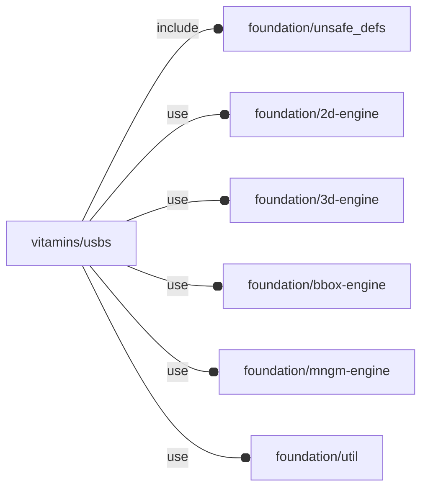

# package vitamins/usbs

## Dependencies



NopSCADlib USB definitions wrapper.

Copyright © 2021, Giampiero Gabbiani (giampiero@gabbiani.org)

SPDX-License-Identifier: [GPL-3.0-or-later](https://spdx.org/licenses/GPL-3.0-or-later.html)


## Variables

---

### variable FL_USB_DICT

__Default:__

    [FL_USB_TYPE_Ax1_NF_SM,FL_USB_TYPE_Ax1,FL_USB_TYPE_Ax1_NF,FL_USB_TYPE_Ax2,FL_USB_TYPE_B,FL_USB_TYPE_C,FL_USB_TYPE_uA,FL_USB_TYPE_uA_NF,]

---

### variable FL_USB_NS

__Default:__

    "usb"

---

### variable FL_USB_TYPE_Ax1

__Default:__

    let(h=6.5,v_flange_l=4.5,bar=0,l=17,w=13.25,flange_t=0.4)[fl_engine(value="USB/Ax1"),fl_bb_corners(value=[[-l/2,-w/2,0],[+l/2,+w/2,h]]),fl_cutout(value=[+FL_X,-FL_X,+FL_Y,-FL_Y,+FL_Z,-FL_Z]),fl_USB_flange(value=true),]

---

### variable FL_USB_TYPE_Ax1_NF

__Default:__

    let(h=6.5,l=17,w=13.25,flange_t=0.4)[fl_engine(value="USB/Ax1"),fl_bb_corners(value=[[-l/2,-w/2,0],[+l/2,+w/2,h]]),fl_cutout(value=[+FL_X,-FL_X,+FL_Y,-FL_Y,+FL_Z,-FL_Z]),fl_USB_flange(value=false),]

---

### variable FL_USB_TYPE_Ax1_NF_SM

__Default:__

    let(h=5.8,l=10,w=13.25)[fl_engine(value="USB/A SM"),fl_bb_corners(value=[[-l,-w/2,0],[0,+w/2,h]]),fl_cutout(value=[+FL_X,-FL_X,+FL_Y,-FL_Y,+FL_Z,-FL_Z]),fl_USB_flange(value=false),]

---

### variable FL_USB_TYPE_Ax2

__Default:__

    let(h=15.6,l=17,w=13.25,flange_t=0.4)[fl_engine(value="USB/Ax2"),fl_bb_corners(value=[[-l/2,-w/2,0],[+l/2,+w/2,h]]),fl_cutout(value=[+FL_X,-FL_X,+FL_Y,-FL_Y,+FL_Z,-FL_Z]),fl_USB_flange(value=true),]

---

### variable FL_USB_TYPE_B

__Default:__

    let(l=16.4,w=12.2,h=11)[fl_engine(value="USB/B"),fl_bb_corners(value=[[-l/2,-w/2,0],[+l/2,+w/2,h]]),fl_cutout(value=[+FL_X,-FL_X,+FL_Y,-FL_Y,+FL_Z,-FL_Z]),fl_USB_flange(value=false),]

---

### variable FL_USB_TYPE_C

__Default:__

    let(l=7.35,w=8.94,h=3.26)[fl_engine(value="USB/C"),fl_bb_corners(value=[[-l/2,-w/2,0],[+l/2,+w/2,h]]),fl_cutout(value=[+FL_X,-FL_X,+FL_Y,-FL_Y,+FL_Z,-FL_Z]),fl_USB_flange(value=false),]

---

### variable FL_USB_TYPE_uA

__Default:__

    let(l=6,iw1=7,h=2.65,t=0.4)[fl_engine(value="USB/uA"),fl_bb_corners(value=[[-l/2,-(iw1+2*t)/2,0],[+l/2,+(iw1+2*t)/2,h]]),fl_cutout(value=[+FL_X,-FL_X,+FL_Y,-FL_Y,+FL_Z,-FL_Z]),fl_USB_flange(value=true),]

---

### variable FL_USB_TYPE_uA_NF

__Default:__

    let(l=6,iw1=7,h=2.65,t=0.4)[fl_engine(value="USB/uA"),fl_bb_corners(value=[[-l/2,-(iw1+2*t)/2,0],[+l/2,+(iw1+2*t)/2,h]]),fl_cutout(value=[+FL_X,-FL_X,+FL_Y,-FL_Y,+FL_Z,-FL_Z]),fl_USB_flange(value=false),]

## Functions

---

### function fl_USB_flange

__Syntax:__

```text
fl_USB_flange(type,value)
```

## Modules

---

### module fl_USB

__Syntax:__

    fl_USB(verbs=FL_ADD,type,cut_thick,cut_tolerance=0,cut_drift=0,cut_direction,tongue="white",direction,octant)

__Parameters:__

__verbs__  
supported verbs: FL_ADD,FL_AXES,FL_BBOX,FL_CUTOUT

__cut_thick__  
thickness for FL_CUTOUT

__cut_tolerance__  
tolerance used during FL_CUTOUT

__cut_drift__  
translation applied to cutout (default 0)

__cut_direction__  
Cutout direction list in floating semi-axis list (see also [fl_tt_isAxisList()](../foundation/traits-engine.md#function-fl_tt_isaxislist)).

Example:

    cut_direction=[+X,+Z]

in this case the usb will perform a cutout along +X and +Z.

:memo: **Note:** axes specified must be present in the supported cutout direction
list (retrievable through [fl_cutout()](../foundation/core.md#function-fl_cutout) getter)


__tongue__  
tongue color

__direction__  
desired direction [director,rotation], native direction when undef ([+X+Y+Z])

__octant__  
when undef native positioning is used


---

### module molex_usb_Ax1

__Syntax:__

    molex_usb_Ax1(cutout,tongue)

Draw Molex USB A connector suitable for perf board

---

### module molex_usb_Ax2

__Syntax:__

    molex_usb_Ax2(cutout,tongue)

Draw Molex dual USB A connector suitable for perf board

---

### module usb_A

__Syntax:__

    usb_A(h,v_flange_l,bar,cutout,tongue,flange=true)

---

### module usb_A_tongue

__Syntax:__

    usb_A_tongue(color)

---

### module usb_Ax1

__Syntax:__

    usb_Ax1(cutout=false,tongue="white",flange=true)

Draw USB type A single socket

---

### module usb_Ax2

__Syntax:__

    usb_Ax2(cutout=false,tongue="white")

Draw USB type A dual socket

---

### module usb_B

__Syntax:__

    usb_B(cutout=false)

Draw USB B connector

---

### module usb_C

__Syntax:__

    usb_C(cutout=false)

Draw USB C connector

---

### module usb_uA

__Syntax:__

    usb_uA(cutout=false,flange=true)

Draw USB micro A connector

