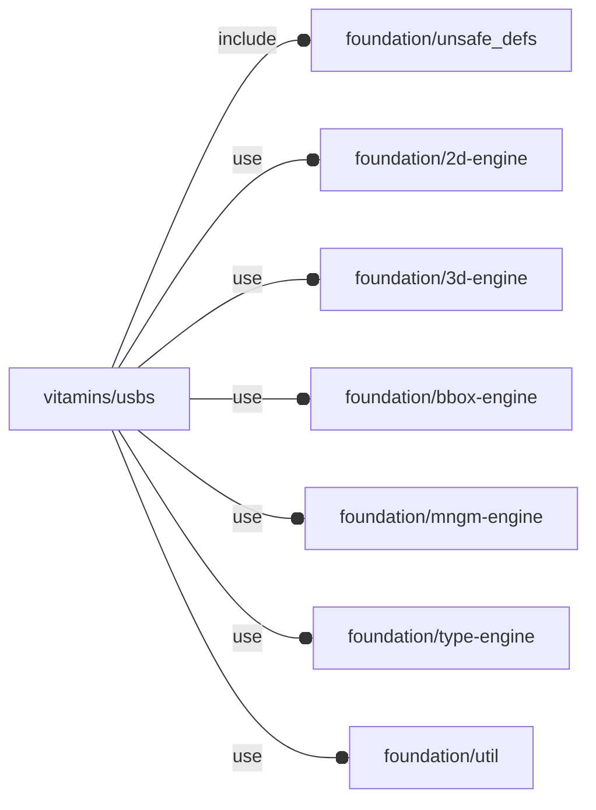

# package vitamins/usbs

## Dependencies



NopSCADlib USB definitions wrapper.

Copyright © 2021, Giampiero Gabbiani (giampiero@gabbiani.org)

SPDX-License-Identifier: [GPL-3.0-or-later](https://spdx.org/licenses/GPL-3.0-or-later.html)


## Variables

---

### variable FL_USB_DICT

__Default:__

    [FL_USB_TYPE_Ax1_NF_SM,FL_USB_TYPE_Ax1,FL_USB_TYPE_Ax1_NF,FL_USB_TYPE_Ax2,FL_USB_TYPE_B,FL_USB_TYPE_C,FL_USB_TYPE_uA,FL_USB_TYPE_uA_NF,]

---

### variable FL_USB_NS

__Default:__

    "usb"

---

### variable FL_USB_TYPE_Ax1

__Default:__

    let(h=6.5,v_flange_l=4.5,bar=0,l=17,w=13.25,flange_t=0.4)fl_Object([[-l/2,-w/2,0],[+l/2,+w/2,h]],engine="USB/Ax1",others=[fl_cutout(value=[+X]),fl_USB_flange(value=true),])

---

### variable FL_USB_TYPE_Ax1_NF

__Default:__

    let(h=6.5,l=17,w=13.25,flange_t=0.4)fl_Object([[-l/2,-w/2,0],[+l/2,+w/2,h]],engine="USB/Ax1",others=[fl_cutout(value=[+X]),fl_USB_flange(value=false),])

---

### variable FL_USB_TYPE_Ax1_NF_SM

__Default:__

    let(h=5.8,l=10,w=13.25)fl_Object([[-l,-w/2,0],[0,+w/2,h]],engine="USB/A SM",others=[fl_cutout(value=[+X]),fl_USB_flange(value=false),])

---

### variable FL_USB_TYPE_Ax2

__Default:__

    let(h=15.6,l=17,w=13.25,flange_t=0.4)fl_Object([[-l/2,-w/2,0],[+l/2,+w/2,h]],engine="USB/Ax2",others=[fl_cutout(value=[+X]),fl_USB_flange(value=true),])

---

### variable FL_USB_TYPE_B

__Default:__

    let(l=16.4,w=12.2,h=11)fl_Object([[-l/2,-w/2,0],[+l/2,+w/2,h]],engine="USB/B",others=[fl_cutout(value=[+X]),fl_USB_flange(value=false),])

---

### variable FL_USB_TYPE_C

__Default:__

    let(l=7.35,w=8.94,h=3.26)fl_Object([[-l/2,-w/2,0],[+l/2,+w/2,h]],engine="USB/C",others=[fl_cutout(value=[+X]),fl_USB_flange(value=false),])

---

### variable FL_USB_TYPE_uA

__Default:__

    let(l=6,iw1=7,h=2.65,t=0.4)fl_Object([[-l/2,-(iw1+2*t)/2,0],[+l/2,+(iw1+2*t)/2,h]],engine="USB/uA",others=[fl_cutout(value=[+X]),fl_USB_flange(value=true),])

---

### variable FL_USB_TYPE_uA_NF

__Default:__

    let(l=6,iw1=7,h=2.65,t=0.4)fl_Object([[-l/2,-(iw1+2*t)/2,0],[+l/2,+(iw1+2*t)/2,h]],engine="USB/uA",others=[fl_cutout(value=[+X]),fl_USB_flange(value=false),])

## Functions

---

### function fl_USB_flange

__Syntax:__

```text
fl_USB_flange(type,value)
```

## Modules

---

### module fl_USB

__Syntax:__

    fl_USB(verbs=FL_ADD,type,cut_thick,cut_tolerance=0,cut_drift=0,cut_dirs,tongue="white",direction,octant)

__Parameters:__

__verbs__  
supported verbs: FL_ADD,FL_AXES,FL_BBOX,FL_CUTOUT

__cut_thick__  
thickness for FL_CUTOUT

__cut_tolerance__  
tolerance used during FL_CUTOUT

__cut_drift__  
translation applied to cutout (default 0)

__cut_dirs__  
FL_CUTOUT direction list. Defaults to all the 'supported' cutout directions

__tongue__  
tongue color

__direction__  
desired direction [director,rotation], native direction when undef ([+X+Y+Z])

__octant__  
when undef native positioning is used


